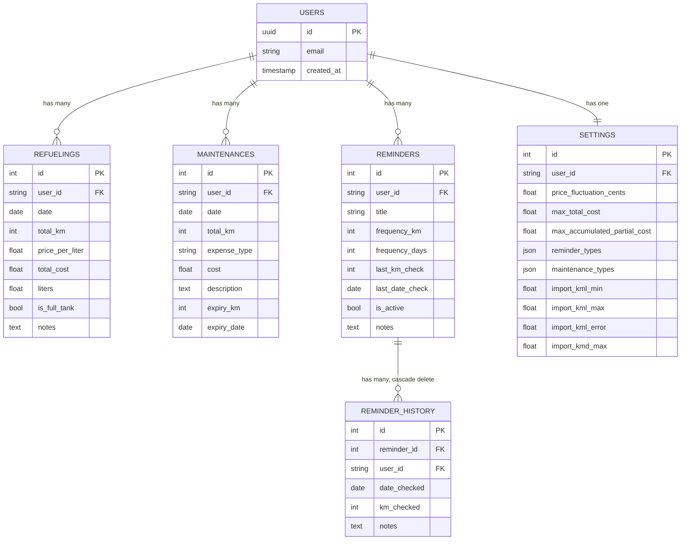

# ARCHITECTURE.md — FuelPyTracker v1.0.0

> **Destinatari:** Tech Lead, Recruiter tecnici, Developer Onboarding.
> Questo documento descrive le decisioni ingegneristiche alla base di FuelPyTracker: perché sono state scelte determinate tecnologie, come è strutturato il codice e quali sfide architetturali sono state affrontate e risolte.

---

## 🎯 1. Executive Summary & Scelta dello Stack

### Origine del progetto

FuelPyTracker nasce da un'esigenza pratica: tracciare i dati di rifornimento e manutenzione del proprio veicolo in modo strutturato e interrogabile. I fogli di calcolo diventano ingestibili nel tempo; le app native richiedono build platform-specifiche. L'obiettivo era uno **strumento web accessibile e data-driven**, costruito con cura nel tempo come progetto personale solido e ben curato.

Ogni scelta tecnologica descritta di seguito riflette questo obiettivo: un'applicazione affidabile, manutenibile e piacevole da usare.

---

### Analisi dello Stack

#### Streamlit

Streamlit elimina completamente la componente frontend. Non c'è HTML da scrivere, nessun bundle JavaScript da configurare, nessun contratto API da definire tra un frontend e un backend separato. Per un progetto a sviluppatore singolo con un dominio orientato ai dati, questa è una scelta ponderata e appropriata.

I limiti del framework sono reali e sono stati accettati consapevolmente:

- **Il routing** non è un concetto nativo. Streamlit non ha un sistema di navigazione basato su URL; la navigazione è gestita via `st.session_state` e un dizionario di funzioni di pagina richiamabili.
- **La gestione dello stato** è effimera per natura (lo script viene rieseguito dall'inizio alla fine ad ogni interazione), il che rende la persistenza della sessione un problema non banale (vedere Sezione 4).
- **Il re-rendering dei widget** richiede una gestione attenta delle chiavi (`key`) per evitare errori `DuplicateWidgetID` e desincronizzazioni di stato.

Queste limitazioni sono state mitigate attraverso la disciplina nel codice, non aggiungendo strati di astrazione.

#### Supabase

Supabase è stato scelto per due ragioni principali:

1. **Autenticazione già pronta.** Il sistema di login — email/password, Magic Link e gestione automatica delle sessioni — è interamente fornito da Supabase. Non è stato necessario costruire e mantenere un sistema di autenticazione personalizzato.
2. **Database PostgreSQL gestito.** Supabase si occupa di ospitare e mantenere il database. Dal punto di vista del codice, l'applicazione si connette a un normale database PostgreSQL: se un giorno si volesse spostare il database su un server proprio, basterebbe aggiornare una sola variabile di configurazione — il resto del codice resterebbe invariato.

Il login e la gestione degli utenti passano per i suoi strumenti dedicati, ma **tutte le operazioni sui dati** (leggere i rifornimenti, salvare una manutenzione, aggiornare le impostazioni) vengono eseguite direttamente sul database tramite SQLAlchemy, senza passare per le API di Supabase. In pratica, Supabase fa da "gestore del database e del login", non da intermediario per ogni singola operazione.

#### OpenAI (GPT-4o Vision)

Fotografare uno scontrino del distributore è un gesto naturale e immediato. Trascriverne manualmente i valori — specialmente su ricevute termiche sbiadite o sgualcite — è invece soggetto a errori e rappresenta un punto di attrito concreto per l'utente. I sistemi OCR tradizionali risolvono questo problema solo in condizioni ideali: falliscono sistematicamente su scontrini a basso contrasto, font non standard o con danni fisici alla carta.

L'integrazione di **GPT-4o Vision** è stata una scelta funzionale. Il modello riceve l'immagine, ne comprende il contesto semantico e restituisce i campi rilevanti in modo strutturato, pronti per la pre-compilazione del form di inserimento.

La funzionalità è completamente opzionale e disabilitabile: se la chiave API non è configurata, l'intero modulo rimane inerte e non incide sulle funzionalità principali dell'applicazione.

---

## 🏗️ 2. Struttura del Progetto: Il Monolite Pulito

FuelPyTracker è un **monolite**: la logica di visualizzazione, le regole di business e l'accesso al database vivono tutti nello stesso processo e nello stesso container Docker. È una scelta deliberata. La complessità di un'architettura a microservizi — deployment separati, comunicazione di rete, autenticazione inter-servizio — non è giustificata quando i requisiti sono quelli di un'applicazione a utente singolo con un solo database.

Il rischio con i monoliti è l'accoppiamento: codice UI che chiama direttamente funzioni di database, logica di business sparsa tra le schermate, valori di configurazione ripetuti in file diversi. Per evitarlo, il codice è organizzato in **tre layer ben separati**, ciascuno con una responsabilità precisa.

### Struttura a Macro-Layer

```
src/
├── ui/               # Layer di Presentazione — solo chiamate st.xyz
│   └── components/   # Un modulo per pagina (dashboard, fuel, maintenance, ...)
│
├── services/         # Layer di Business Logic — Python puro, indipendente dal framework
│   ├── business/     # Calcoli di dominio (consumo, health score, previsioni)
│   ├── data/         # Pipeline di import/export (parsing CSV, validazione, Excel)
│   │   ├── importers/
│   │   └── exporters/
│   ├── ocr/          # Analisi AI degli scontrini (wrapper GPT-4o Vision)
│   └── auth/         # Client Supabase Auth e router magic-link
│
├── database/         # Layer di Accesso ai Dati — modelli SQLAlchemy e operazioni CRUD
│   ├── models.py     # Definizioni entità ORM
│   ├── crud.py       # Tutte le operazioni di lettura/scrittura sul DB
│   └── core.py       # Engine, SessionLocal, init_db()
│
├── auth/             # Layer di Sessione — gestione del ciclo di vita dei token
│   ├── session_handler.py   # Strategia di persistenza token via URL param
│   └── auth_interface.py    # UI Login/Register (qui per coesione funzionale)
│
└── config.py         # Loader centralizzato per la configurazione TOML
```

### La Separazione tra i Layer

Il principio guida è semplice: il codice della UI (`src/ui/`) non parla mai direttamente con il database, e il database non sa nulla di Streamlit. Ogni layer comunica solo con quello adiacente, tramite oggetti Python standard (dizionari, dataclass, liste).

`src/services/` contiene funzioni **Python puro**: accettano e restituiscono tipi standard, possono essere testate con unit test senza avviare un server Streamlit, ed è esattamente così che è strutturata la suite di test sotto `tests/`.

Per le performance, il sistema sfrutta il caching integrato di Streamlit (`@st.cache_data`): i dati già letti dal database vengono tenuti in memoria e riutilizzati, evitando query ripetute ad ogni interazione dell'utente.

---

## 🗄️ 3. Schema del Database & Object Model

Il modello dati è volutamente minimale. Cinque tabelle applicative servono l'intero dominio; una sesta (`users`) è di proprietà e gestita da Supabase Auth.

Tutte le tabelle applicative portano una colonna `user_id: String`, indicizzata e non nullable. Questa colonna è il **meccanismo primario di isolamento** dei dati per utente (vedere Sezione 4).

### Diagramma Entità-Relazione



### Scelte di Semplificazione

Il modello dati riflette scelte consapevoli per tenere il database snello. Le categorie di manutenzione e promemoria — che l'utente può personalizzare — sono memorizzate come colonne `JSON` direttamente nella tabella `SETTINGS`, invece di introdurre tabelle aggiuntive. Per quella che è di fatto una semplice lista di stringhe personalizzabili, una colonna JSON è la soluzione più efficace e mantenibile.

La v1.0.0 è esplicitamente mono-veicolo per utente: non esiste una tabella `Vehicles`. È un vincolo di scope deliberato. La naturale evoluzione verso la gestione multi-veicolo — aggiungere una tabella `vehicles` con chiave esterna da `refuelings` e `maintenances` — non richiederebbe un refactoring significativo dell'architettura esistente.

Eliminare un promemoria (`Reminder`) cancella automaticamente tutto il suo storico tramite la direttiva `cascade="all, delete-orphan"` di SQLAlchemy. È una scelta deliberata: lasciare record orfani nel database per dati senza più un contesto significativo non porta alcun valore e complicherebbe le query di lettura.

---

## 🔒 4. Sicurezza e Gestione della Sessione

### 4.1 Persistenza della Sessione tramite URL

In qualsiasi applicazione web la persistenza della sessione è tipicamente gestita tramite cookie HTTP. Streamlit non espone un'API nativa per scriverli. La soluzione adottata sfrutta un meccanismo che il browser offre nativamente: **l'URL**.

Questa è la scelta architettonica definitiva per gestire l'autenticazione in FuelPyTracker. Dopo un login Supabase riuscito, sia l'`access_token` (JWT, validità 1 ora) che il `refresh_token` (validità 30 giorni) vengono salvati nei parametri dell'URL. Il browser preserva nativamente l'URL completo anche quando la pagina viene ricaricata. A ogni riesecuzione dello script, il modulo `session_handler.py` legge questi parametri e li presenta a Supabase Auth per la validazione: se i token sono validi, la sessione viene ripristinata e — se necessario — rinnovata automaticamente. Se i token sono scaduti o invalidi, i parametri vengono rimossi e l'utente viene reindirizzato al login.

Il risultato è una **sessione auto-rinnovante** che sopravvive ai refresh del browser e si comporta in modo identico a una sessione tradizionale, senza richiedere infrastrutture aggiuntive. Il ciclo di vita completo è gestito in `src/auth/session_handler.py`.

---

### 4.2 Isolamento dei Dati per Utente

Supabase Auth conferma l'identità dell'utente. Garantire che ogni utente veda **esclusivamente i propri dati** è responsabilità dell'applicazione, implementata come scelta esplicita a livello di accesso al database.

Ogni query in `src/database/crud.py` include **obbligatoriamente** un filtro sull'`user_id` dell'utente autenticato. Questo vale tanto per le letture quanto per le scritture e le cancellazioni: un'operazione sul record ID 42 restituirà silenziosamente un risultato nullo se quel record non appartiene all'utente corrente, anche se l'ID fosse noto. Non esiste nessun percorso di codice attraverso il quale un utente autenticato possa leggere o modificare i dati di un altro utente.

Lo `user_id` viene sempre derivato da `st.session_state.user.id`, popolato esclusivamente da una validazione riuscita dei token Supabase. `main.py` reindirizza verso la schermata di login se questo campo è assente, rendendo l'intero layer CRUD irraggiungibile per le sessioni non autenticate.

---

## 💎 5. Deep Dive: Soluzioni Progettuali

### 5.1 Il Feature Flag `DEMO_MODE`

La demo pubblica espone l'intera UI dell'applicazione senza richiedere un account reale. Il meccanismo è un **feature flag** (`DEMO_MODE`) che, quando attivo, inietta un utente isolato con un UUID Supabase dedicato, disabilita tutte le scritture nella UI e sostituisce il modulo OCR con un mock locale che simula la latenza reale ma non consuma nessun token API. I dati mostrati sono pre-caricati e in sola lettura dal punto di vista dell'utente.

Il flag è verificabile da due sorgenti — variabile d'ambiente OS per Docker, `st.secrets` per Streamlit Cloud — garantendo la stessa esperienza in entrambi gli ambienti di deploy. La difesa è stratificata: anche se una guardia UI venisse accidentalmente bypassata, il dominio dati rimane isolato all'account demo dedicato.

---

### 5.2 La Pipeline di Importazione: Valida Prima di Scrivere

La funzionalità di importazione CSV/Excel segue un processo rigoroso in quattro fasi: **parsing → validazione → revisione interattiva → salvataggio**. Nessun dato viene scritto sul database finché non viene confermato esplicitamente dopo aver revisionato il risultato della validazione.

**Fase 1 — Parsing & Normalizzazione**

Il file caricato viene normalizzato: gli header vengono convertiti in minuscolo e ripuliti dagli accenti, gli alias noti vengono mappati ai nomi canonici tramite un dizionario `ALIAS_MAP`, e le colonne opzionali mancanti (`litri`, `pieno`, `note`) vengono aggiunte con valori di default sicuri. Il file sorgente non viene mai modificato.

**Fase 2 — Validazione Riga per Riga**

Il motore di validazione recupera l'intero storico rifornimenti dell'utente in una **singola query** per evitare il problema N+1, poi costruisce due strutture di ricerca veloci:

- `ref_map: {(date, km) → Refueling}` — per la riconciliazione a corrispondenza esatta
- `date_map: {date → Refueling}` — per il rilevamento di duplicati nella stessa giornata

Ogni riga viene classificata in uno di cinque stati:

| Stato | Significato |
|-------|-------------|
| `Nuovo` | Record non presente nel DB; supera tutti i controlli; sicuro da inserire |
| `Modifica` | Corrispondenza esatta su `(data, km)` trovata; differenze rilevate sui campi; verrà aggiornato |
| `Invariato` | Corrispondenza esatta trovata; nessuna differenza; verrà saltato |
| `Errore` | Validazione fallita — data futura, regressione km, duplicato, consumo fisicamente impossibile |
| `Warning` | Anomalia sospetta ma non bloccante — consumo carburante fuori soglia normale |

Il **Sandwich Check** verifica la coerenza chilometrica cronologica: il `total_km` di ogni record importato deve essere strettamente maggiore del km del rifornimento precedente *e* strettamente minore del km del rifornimento successivo. Questo blocca regressioni del contachilometri e inserimenti fuori sequenza prima ancora che tocchino il database.

Il **Check km/L** viene eseguito sulla timeline combinata (dati già nel DB + righe del file in fase di import), usando soglie configurabili dall'utente nella sezione Impostazioni:

```
kml_min  ≤  delta_km / litri  ≤  kml_max      →  OK
fuori da [kml_min, kml_max] ma < kml_error     →  Warning
≥ kml_error                                    →  Errore (fisicamente impossibile)
```

I rifornimenti parziali (`is_full_tank = False`) vengono **esclusi dal calcolo km/L** per una ragione matematica precisa: se il serbatoio non viene portato al pieno, non è possibile sapere con certezza quanti litri siano stati consumati dall'ultimo rifornimento completo. Il calcolo sarebbe privo di significato e potrebbe generare valori fuorvianti. Per lo stesso motivo, viene saltato anche il record che segue immediatamente un parziale: anche in quel caso il punto di riferimento per il consumo non è definito. Si tratta di una misura di protezione della coerenza dei dati, non di una limitazione. Questo caso limite ha una copertura dedicata nella suite di test unitari.

**Fase 3 — Revisione Interattiva**

Il risultato della validazione viene presentato all'utente tramite **una tabella interattiva** (separata per rifornimenti e per manutenzioni). Ogni riga mostra il proprio stato (`Nuovo`, `Warning`, `Errore`, ecc.) e una nota descrittiva. È possibile correggere i valori direttamente nelle celle della tabella prima di procedere: ogni modifica viene rivalutata in tempo reale dalla pipeline di validazione, così da poter vedere subito l'effetto delle correzioni. Solo quando i dati sembrano coretti si può procedere al salvataggio.

**Fase 4 — Salvataggio**

Solo le righe con stato `Nuovo`, `Warning` (accettato consapevolmente) o `Modifica` vengono scritte sul database. Le righe `Errore` o `Invariato` vengono silenziosamente saltate. Ogni scrittura riuscita invalida la cache delle query attive, garantendo che la dashboard rifletta immediatamente il nuovo stato dei dati.

Il risultato è un sistema di importazione che **protegge l'integrità del database per costruzione**: nessun dato inconsistente, duplicato o cronologicamente impossibile può essere salvato senza che venga mostrato e approvato esplicitamente.

---

## 📦 6. Deploy & Configurazione

L'applicazione è containerizzata con Docker e progettata per un deploy con un singolo comando:

```
docker compose up --build
```

La configurazione segue una **gerarchia a due livelli**:

1. **`.streamlit/secrets.toml`** — credenziali runtime (URL del database, credenziali Supabase, chiave API OpenAI, ID utente demo). Questo file non viene mai committato nel version control.
2. **`config.toml`** — parametri di logica applicativa (soglie di consumo, limiti di costo, etichette delle categorie). Questo file è committato e fornisce una fonte di verità documentata e versionata per i parametri operativi.

`src/config.py` implementa un loader TOML tollerante agli errori: se `config.toml` è assente o malformato, l'applicazione utilizza automaticamente dei valori predefiniti integrati e registra un avviso nel log, senza bloccarsi. In questo modo l'app rimane avviabile in qualsiasi ambiente, anche quando viene iniettato solo il file dei secrets.

L'engine SQLAlchemy è configurato con `NullPool` per gestire correttamente le connessioni al database quando più utenti o più schede del browser sono aperte contemporaneamente. Senza questa configurazione, ogni thread di Streamlit potrebbe aprire e trattenere connessioni al database che non vengono rilasciate correttamente, portando all'esaurimento del pool disponibile. `NullPool` risolve il problema aprendo e chiudendo la connessione in modo pulito ad ogni operazione.

---

*Versione documento: 1.1.0 — Aprile 2026*
*Autore: [Lorenzo Polizzi](https://www.linkedin.com/in/lorenzo-polizzi-profile/) — [Repository](https://github.com/Lorenzo-001/FuelPyTracker)*
