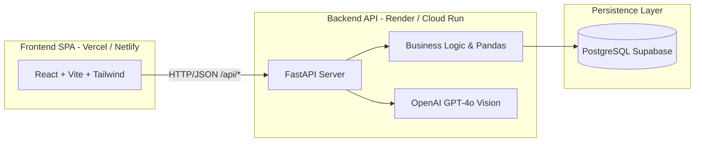
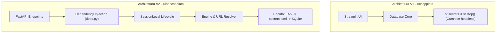
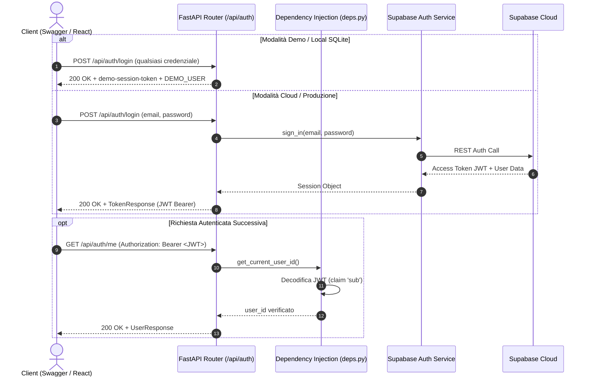
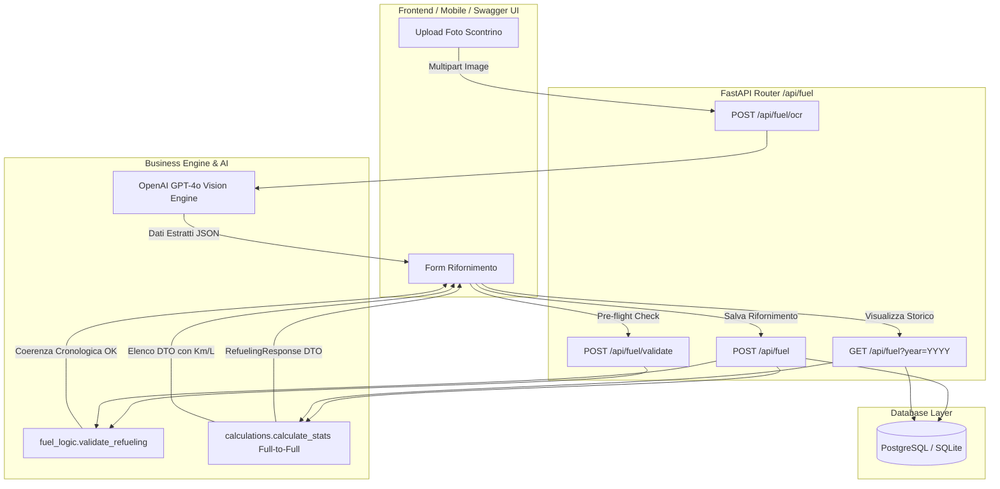
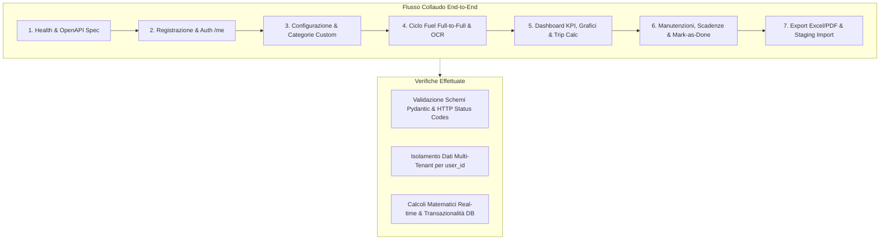
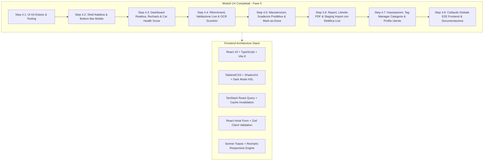

# ARCHITECTURE.md — FuelPyTracker v2.0

> **Destinatari:** Tech Lead, Recruiter tecnici, Full-Stack Developer Onboarding.  
> Questo documento traccia l'evoluzione ingegneristica di FuelPyTracker verso la **Versione 2.0**: il passaggio strategico da un'applicazione monolitica basata su Streamlit a un'architettura **completamente disaccoppiata (Headless)**, ad alte prestazioni, basata su **FastAPI** e **React**.

---

## 🎯 1. La Visione della V2: Perché la Migrazione Headless

### Il contesto di partenza (v1.x)
La prima versione di FuelPyTracker (v1.0 - v1.1.0) è stata costruita adottando **Streamlit**. Questa scelta ha permesso di validare rapidamente l'idea di business e consolidare oltre 1.500 righe di logica analitica solida:
- Calcolo dei consumi con algoritmo *Full-to-Full*.
- Analisi cronologica dei chilometri e individuazione delle anomalie.
- Integrazione dell'OCR multimodale con OpenAI GPT-4o per la lettura scontrini.
- Esportazione avanzata in PDF ed Excel.

### I colli di bottiglia di Streamlit
Man mano che l'applicazione è cresciuta, i vincoli strutturali del paradigma monolitico di Streamlit sono emersi con chiarezza:
1. **Ciclo di vita effimero (Script Re-run):** Ad ogni interazione utente (un clic, una selezione, un tasto premuto), l'intero script Python viene rieseguito dall'inizio alla fine. Ciò impone una gestione complessa e fragile dello stato in memoria (`st.session_state`) e genera latenze percepite.
2. **Assenza di Routing nativo:** Streamlit non espone URL semantici per pagina (es. `/dashboard`, `/fuel`, `/maintenance`), costringendo a un routing artigianale tramite pulsanti e dizionari di funzioni.
3. **User Experience rigida:** Impossibilità di gestire micro-interazioni moderne, transizioni fluide, skeleton loaders durante il caricamento e layout realmente responsive ottimizzati per smartphone.
4. **Footprint di memoria e costi:** Un processo Streamlit mantiene in memoria il rendering grafico e i dati, rendendo l'hosting gratuito soggetto a crash per memoria esaurita o a continui riavvii.

### La decisione architetturale: Disaccoppiamento Totale
La Versione 2.0 adotta un'architettura **Frontend/Backend disaccoppiata**:
- **Backend (FastAPI):** Mantiene il codice Python per non riscrivere la preziosa logica dati, ma si trasforma in un server API REST puro, leggerissimo e asincrono.
- **Frontend (React + Vite + TailwindCSS + Shadcn/UI):** Una Single Page Application (SPA) ultra-veloce, compilata staticamente su CDN Edge globale, con rendering interamente client-side.
- **Obiettivo Hosting a Costo Zero (Zero-Cost Hosting):** Il frontend vive gratuitamente su CDN (Vercel o Netlify) con caricamento istantaneo (TTFB < 50ms); il backend vive su un PaaS gratuito (Render o Cloud Run) ottimizzato per ridurre al minimo i consumi.



---

## 🌿 2. La Strategia di Transizione: Il Pattern "Strangler Fig"

Per migrare l'applicazione senza fermare la produzione né incorrere nei rischi del "Big Bang rewrite", abbiamo adottato il pattern **Strangler Fig (il Fico Strangolatore)**:
- Il nuovo backend FastAPI non viene sviluppato in un repository separato al buio, ma **germoglia all'interno dello stesso repository**, incapsulando progressivamente la logica e i moduli già collaudati (`src/services/`, `src/database/`).
- **Nessun downtime e verifica comparativa:** Durante tutte le fasi di sviluppo della V2, l'applicazione Streamlit v1.1.0 continua a funzionare regolarmente. Questo offre il vantaggio inestimabile di poter confrontare in tempo reale i risultati forniti dalle nuove API con l'output della vecchia interfaccia grafica.

---

## 🏛️ 3. Fase 1: Riorganizzazione Architetturale (Il Monorepo)

La prima fase esecutiva ha trasformato il repository da un monolite disordinato a un **Monorepo Organizzato**, preparando il terreno per accogliere i due silos indipendenti: `backend/` e `frontend/`.

### Struttura delle Directory

```text
FuelPyTracker/
├── backend/                       <-- Silo Backend Python
│   ├── .streamlit/                <-- Configurazioni runtime legacy
│   │   ├── config.toml
│   │   └── secrets.toml.example
│   ├── src/
│   │   ├── api/                   <-- [NUOVO] Motore REST FastAPI
│   │   │   ├── config.py          <-- Setup ambiente e CORS
│   │   │   ├── deps.py            <-- Dependency Injection e autenticazione
│   │   │   ├── server.py          <-- Entrypoint FastAPI & Uvicorn
│   │   │   ├── routers/           <-- Endpoint suddivisi per dominio
│   │   │   └── schemas/           <-- Contratti dati Pydantic
│   │   ├── database/              <-- SQLAlchemy Core, Models, CRUD
│   │   ├── services/              <-- Business logic (Fuel, Calc, OCR)
│   │   └── ui/                    <-- Schermate Streamlit legacy (in dismissione)
│   ├── tests/                     <-- Suite pytest unificata
│   ├── Dockerfile                 <-- Dockerfile per il container backend
│   ├── main.py                    <-- Entrypoint Streamlit V1
│   └── requirements.txt           <-- Dipendenze Python (FastAPI + Uvicorn)
├── frontend/                      <-- [Fase 3] Silo React + Vite + Tailwind
├── docs/                          <-- Documentazione ufficiale di progetto
│   ├── ARCHITECTURE.md            <-- Documentazione V1 (Streamlit)
│   └── v2/                        <-- [NUOVO] Documentazione ufficiale V2
│       ├── ARCHITECTURE.md        <-- Questo documento
│       └── SETUP_GUIDE.md         <-- Guida avvio e configurazione V2
├── _cantiere/                     <-- Area di lavoro e roadmap temporanea
└── docker-compose.yml             <-- Orchestrazione container locale
```

### Adeguamento del Contesto Docker
Il file `docker-compose.yml` è rimasto nella radice del repository per consentire l'orchestrazione con un solo comando, ma il contesto di build è stato aggiornato puntando a `./backend`:
```yaml
services:
  app:
    build:
      context: ./backend
      dockerfile: Dockerfile
```

---

## ⚡ 4. Il Motore API: FastAPI & Uvicorn

Nella Fase 1 abbiamo introdotto **FastAPI** come cuore pulsante del backend:

### Perché FastAPI?
1. **Velocità e Asincronia:** Basato sullo standard **ASGI** e alimentato da **Uvicorn**, garantisce un throughput di richieste incomparabilmente superiore a qualsiasi framework sincrono tradizionale.
2. **Contratti Dati Nativi (Pydantic):** Validazione automatica e serializzazione istantanea di ogni richiesta e risposta HTTP. Se il client invia un dato errato o mancante, FastAPI risponde con un messaggio di errore chiaro (HTTP 422) senza toccare la logica interna.
3. **Documentazione OpenAPI Autogenerata:** FastAPI analizza il codice Python e i tipi definiti, generando automaticamente la specifica OpenAPI e l'interfaccia interattiva **Swagger UI**.

### Configurazione CORS
Per consentire al futuro client React (in esecuzione su domini diversi come `localhost:5173` o sul dominio di produzione Vercel) di comunicare senza blocchi di sicurezza da parte dei browser, abbiamo integrato il middleware `CORSMiddleware`:
```python
app.add_middleware(
    CORSMiddleware,
    allow_origins=CORS_ORIGINS,
    allow_credentials=True,
    allow_methods=["*"],
    allow_headers=["*"],
)
```

---

## 🧊 5. Mitigazione del Cold Start (Strategia Zero-Cost Hosting)

Una delle sfide più critiche nell'ospitare backend gratuiti su piattaforme PaaS moderne (come Render, Railway o Fly.io) è il fenomeno del **Server Sleep**:
- Dopo 10-15 minuti di inattività, il container viene spento per risparmiare risorse.
- Alla richiesta successiva dell'utente, il server deve riavviarsi da zero (*Cold Start*), introducendo una latenza che può variare dai 30 ai 50 secondi.

### La soluzione architetturale: `GET /health`
Abbiamo implementato fin dalla Fase 1 un endpoint strategico ultra-leggero e non autenticato:
```python
@app.get("/health", tags=["System"])
def health_check():
    return {
        "status": "ok",
        "version": "2.0.0",
        "timestamp": datetime.datetime.utcnow().isoformat()
    }
```
**Come funziona la mitigazione:**
Un servizio di monitoraggio uptime esterno e gratuito (es. **UptimeRobot**, cron-job di GitHub Actions o BetterStack) invia una richiesta HTTP leggera a `/health` ogni 10 minuti. Questo "battito cardiaco" costante impedisce al server di addormentarsi, azzerando i tempi di attesa per l'utente finale a costo zero.

### 5.1 Il Risvolto del Polling: Gestione del Log Noise & Endpoint Filtering

L'introduzione di probe periodici ad alta frequenza (UptimeRobot ogni 10 min, unito al polling continuo del client React tramite `useSystemHealth` ogni 15 secondi per verificare lo stato di connessione) comporta un rischio architetturale noto: la **Log Fatigue** (inquinamento da log di routine).

Senza un'adeguata configurazione, il server ASGI (Uvicorn) produce un flusso ininterrotto di righe di accesso (`INFO: "GET /health HTTP/1.1" 200 OK`), rendendo quasi impossibile per lo sviluppatore individuare a colpo d'occhio eccezioni reali, slow query o errori `500`.

Per risolvere alla radice questo problema, abbiamo implementato un'architettura di logging centralizzata in [`backend/src/api/logging_config.py`](file:///c:/Progetti/git/FuelPyTracker/backend/src/api/logging_config.py):

1. **`EndpointFilter` su `uvicorn.access`:**
   Un filtro personalizzato che intercetta i log HTTP di Uvicorn e sopprime le richieste verso percorsi di diagnostica frequente (`/health`, `/favicon.ico`). Le chiamate operative di business (`/api/fuel`, `/api/reminders`, `/api/maintenance`) e tutti gli errori di rete rimangono invece perfettamente visibili nel terminale.
   ```python
   class EndpointFilter(logging.Filter):
       def __init__(self, excluded_endpoints=("/health", "/favicon.ico")):
           super().__init__()
           self.excluded_endpoints = tuple(excluded_endpoints)

       def filter(self, record: logging.LogRecord) -> bool:
           message = record.getMessage()
           if any(ep in message for ep in self.excluded_endpoints):
               return False
           if record.args:
               args_str = " ".join(str(a) for a in record.args)
               if any(ep in args_str for ep in self.excluded_endpoints):
                   return False
           return True
   ```

2. **Silenziamento dei Warning Legacy di Streamlit (`cda._LOGGER.disabled`):**
   Durante la migrazione ibrida (Strangler Fig), l'importazione di moduli condivisi come `crud.py` da parte dei router FastAPI faceva scattare il logger interno di Streamlit (`No runtime found, using MemoryCacheStorageManager`), che veniva emesso per ciascuna delle funzioni decorate con `@st.cache_data`.
   Nel modulo `logging_config.py` disabilitiamo questo logger specifico all'avvio:
   ```python
   import streamlit.runtime.caching.cache_data_api as cda
   cda._LOGGER.disabled = True
   ```

3. **Integrazione con il Lifespan di FastAPI (`server.py`):**
   Uvicorn spesso riconfigura i propri handler di logging durante lo spawn del processo worker. Attraverso il context manager asincrono `lifespan(app: FastAPI)` introdotto in `server.py`, la funzione `configure_api_logging()` viene riapplicata durante l'evento di startup, garantendo che i filtri rimangano attivi per l'intero ciclo di vita dell'applicazione.

---

## 📖 6. Documentazione Interattiva e Developer Experience (Swagger UI)

Una delle priorità della Fase 1 è stata l'azzeramento della frizione per sviluppatori e tester:
- **Swagger UI** è attivo e raggiungibile all'indirizzo `/docs` (es. `http://localhost:8000/docs`). Da qui è possibile esplorare tutti gli endpoint, leggere gli schemi dei dati e testare le chiamate in tempo reale cliccando su *"Try it out"*.
- **Redirect automatico dalla root (`/`):** Per evitare schermate `404 Not Found` digitando semplicemente l'indirizzo base `http://localhost:8000`, abbiamo implementato un reindirizzamento automatico permanente verso `/docs`:
  ```python
  @app.get("/", include_in_schema=False)
  def root():
      return RedirectResponse(url="/docs")
  ```

---

## 🔌 7. Fase 2.1: Fondamenta Core, Disaccoppiamento DB e Dependency Injection

La transizione verso un'architettura Headless ha richiesto di affrontare il debito di accoppiamento accumulato nella V1, dove il motore di persistenza dei dati era saldato alle primitive grafiche di Streamlit.

### Il Problema: L'accoppiamento con il runtime di Streamlit
Nel codice originale di `src.database.core`:
- La stringa di connessione veniva prelevata unicamente da `st.secrets["database"]["url"]`.
- In caso di database non raggiungibile o credenziali mancanti, il codice invocava direttamente `st.error()` (per disegnare l'alert box a schermo) e `st.stop()` (per congelare il thread di rendering).

All'interno di un server web headless come FastAPI, l'invocazione di queste funzioni sollevava eccezioni critiche (`ScriptRunContext missing` o `StreamlitSecretNotFoundError`), mandando in crash l'intero processo all'avvio.



### La Soluzione: Risoluzione Resiliente dell'URL (`url.py`)
Abbiamo introdotto una gerarchia di risoluzione dell'URL di connessione totalmente autonoma:
1. **Variabile d'ambiente OS (`DATABASE_URL`):** Massima priorità. Gestisce in automatico anche la normalizzazione del prefisso legacy `postgres://` in `postgresql://` (necessario per SQLAlchemy su piattaforme come Render ed Heroku).
2. **Flag `LOCAL_SQLITE=True`:** Modalità sandbox per bootstrap immediato senza cloud (`sqlite:///data/local.db`).
3. **Parametro esplicito (`secrets_url`):** Utilizzato da Streamlit o da chiamanti specifici.
4. **File locale `secrets.toml`:** Letto direttamente tramite parser TOML senza dipendere dal framework grafico.

In `core.py`, la funzione `_is_streamlit_running()` rileva dinamicamente il contesto: se l'app gira sotto Streamlit mostra gli avvisi grafici V1; se gira sotto FastAPI solleva normali eccezioni Python e produce log strutturati.

### Dependency Injection e Gestione della Sessione (`deps.py`)
FastAPI adotta il pattern della **Dependency Injection** per garantire l'isolamento e la scalabilità:

```python
def get_db() -> Generator[Session, None, None]:
    """
    Fornisce una sessione SQLAlchemy isolata per singola richiesta HTTP.
    Garantisce la chiusura pulita (db.close()) nel blocco finally.
    """
    db = SessionLocal()
    try:
        yield db
    finally:
        db.close()
```

- **Prevenzione dei Memory Leak:** La sessione viene aperta al momento dell'ingresso nella route e chiusa in modo garantito al termine della risposta, evitando il consumo incontrollato del pool di connessioni su PostgreSQL.
- **Autenticazione Trasparente (`get_current_user_id`):** 
  - Estrae e valida il token Bearer JWT di Supabase (recuperando l'UUID dal claim `sub`).
  - Supporta l'header `X-User-Id` per semplificare i test automatici.
  - Esegue il fallback trasparente sull'utente demo (`DEMO_USER_ID`) quando l'ambiente è configurato in Sandbox o SQLite locale, permettendo di testare tutte le API direttamente da Swagger UI senza login preventivo.
  - Blocca gli accessi non autorizzati in ambiente di produzione con HTTP 401.

### Configurazione Centralizzata (`config.py`)
Il modulo `src.api.config` incapsula il caricamento di `.env` (cercando sia nella cartella `backend/` che nella radice del progetto) ed espone costanti tipizzate per le API (`API_TITLE`, `API_VERSION`, `CORS_ORIGINS`, `DEMO_MODE`).

---

## 🔐 8. Fase 2.2: Autenticazione, Contratti Dati Pydantic e Router /api/auth

La Fase 2.2 ha introdotto il primo dominio funzionale della V2: la gestione dell'identità utente, l'emissione di token JWT e la standardizzazione dei contratti dati.

### I Contratti Dati Pydantic (`schemas/auth.py`)
In un'architettura disaccoppiata, il server API deve garantire che i dati scambiati rispettino vincoli rigorosi di forma e tipo. Abbiamo adottato **Pydantic v2** per definire i contratti dati (DTO) di input e output:

- **`LoginRequest` / `RegisterRequest`:** Validazione formale dell'email tramite `EmailStr` (alimentato dalla libreria `email-validator`) e vincolo di sicurezza sulla lunghezza minima della password (`Field(..., min_length=6)`).
- **`UserResponse`:** Espone solo le informazioni necessarie al frontend (`id`, `email`, `is_demo`), escludendo metadati sensibili.
- **`TokenResponse`:** Modella la sessione di autenticazione (`access_token`, `token_type: "bearer"`, `user: UserResponse`).
- **`PasswordResetRequest` & `MessageResponse`:** Strutture standardizzate per flussi di ripristino credenziali e messaggi informativi.

*Vantaggio architetturale:* Se un client invia un payload malformato, FastAPI intercetta l'errore a monte e risponde automaticamente con un codice **HTTP 422 Unprocessable Entity** e una spiegazione dettagliata, impedendo al dato non valido di raggiungere i servizi di backend.

### Disaccoppiamento di Supabase Auth (`services/auth/auth_service.py`)
Nella V1, l'istanza del client Supabase era legata a doppio filo a `st.session_state` e `st.secrets`:
- Abbiamo introdotto la funzione `_get_supabase_credentials()` che preleva le chiavi da variabili d'ambiente (`SUPABASE_URL`, `SUPABASE_KEY`) o dal file `secrets.toml` tramite parser nativo.
- `get_client()` opera ora in modo polimorfico: in Streamlit preserva l'isolamento della sessione in memoria per utente; fuori da Streamlit (FastAPI e worker) crea client stateless ad alte prestazioni.



### Gli Endpoint del Router `/api/auth`
Il modulo `src.api.routers.auth` espone 5 route RESTful integrate in `server.py`:
1. **`POST /api/auth/login`**: Autentica l'utente e restituisce il token JWT; in modalità Demo rilascia un token immediato consentendo il testing istantaneo.
2. **`POST /api/auth/register`**: Registrazione di un nuovo account (HTTP 201 Created).
3. **`POST /api/auth/logout`**: Terminazione della sessione e pulizia token.
4. **`GET /api/auth/me`**: Restituisce il profilo dell'utente autenticato utilizzando la dependency injection `get_current_user_id`.
5. **`POST /api/auth/reset-password`**: Inoltro della richiesta di ripristino password via email.

---

## ⛽ 9. Fase 2.3: Dominio Fuel, Calcoli Full-to-Full e Pipeline OCR Scontrini

La Fase 2.3 implementa il nucleo applicativo principale di FuelPyTracker: la registrazione, consultazione, modifica ed eliminazione dei rifornimenti, il calcolo delle metriche di efficienza energetica (Km/L e Delta Km) e l'elaborazione computer vision degli scontrini carburante.



### I Contratti Dati Pydantic (`schemas/fuel.py`)
Tutte le transazioni con il dominio Carburante sono regolate da schemi Pydantic con validazione preventiva a livello di attributo:

- **`RefuelingBase`**: Campi anagrafici essenziali (`date`, `total_km`, `price_per_liter`, `total_cost`, `liters`, `is_full_tank`, `notes`), con vincoli rigorosi di positività (`gt=0`) per litri, spesa e chilometri.
- **`RefuelingCreate` & `RefuelingUpdate`**: Modelli dedicati rispettivamente alla creazione e alla modifica parziale (tutti i campi opzionali per aggiornamenti chirurgici).
- **`RefuelingResponse`**: Estende `RefuelingBase` includendo l'identificativo univoco del record, il `user_id` e le metriche calcolate a posteriori:
  - `delta_km`: Chilometri percorsi dall'ultimo rifornimento registrato.
  - `km_per_liter`: Efficienza media calcolata secondo l'algoritmo Full-to-Full (arrotondata a 2 cifre decimali).
  - `days_since_last`: Giorni intercorsi rispetto al rifornimento precedente.
- **`RefuelingValidationRequest` / `RefuelingValidationResponse`**: Modelli per il controllo pre-flight asincrono in fase di digitazione.
- **`OCRScanResponse`**: Contratto dati standardizzato per la risposta dell'estrazione computer vision (`success`, `total_cost`, `price_per_liter`, `liters`, `date`, `station_name`, `raw_text`).

### Isolamento Multi-Tenant e Operazioni CRUD (`routers/fuel.py`)
Tutti gli endpoint del router `/api/fuel` richiedono l'autenticazione tramite la dependency `get_current_user_id`:
- **Isolamento Rigoroso:** Ogni query al database applica sistematicamente il filtro `user_id == current_user_id`. Un utente non può in alcun modo leggere, modificare o eliminare record appartenenti ad altri account (in caso di accesso a ID non pertinenti, il server restituisce **HTTP 404 Not Found** senza rivelare l'esistenza della risorsa).
- **Filtro Temporale:** `GET /api/fuel?year=2025` consente di recuperare solo le registrazioni pertinenti all'anno di interesse, ottimizzando il payload di rete per i cruscotti annuali.

### Il Motore di Calcolo Consumi Full-to-Full
Il metodo convenzionale (dividere semplicemente chilometri per litri su un singolo pieno parziale) produce stime altamente imprecise. FuelPyTracker V2 adotta l'algoritmo **Full-to-Full**:
1. Le metriche di consumo (`km_per_liter`) vengono calcolate solo in occasione di un rifornimento con esito **Pieno** (`is_full_tank = True`).
2. L'algoritmo esegue un backtracking nello storico del singolo utente per rintracciare il **Pieno precedente** (ancora di riferimento).
3. Tutti i rifornimenti intermedi parziali vengono sommati nei litri totali consumati.
4. L'efficienza reale è data dalla distanza totale percorsa tra i due pieni divisa per la somma cumulativa dei litri erogati.

### Integrità Cronologica e Validazione Pre-Flight (`/api/fuel/validate`)
Per prevenire errori materiali di digitazione da parte dell'utente:
- Prima di ogni inserimento o aggiornamento, il backend verifica la coerenza contro i rifornimenti cronologicamente adiacenti (`prev_record` e `next_record`).
- Se l'utente tenta di salvare una lettura chilometrica inferiore a quella di un rifornimento precedente o superiore a quella di un rifornimento successivo, la richiesta viene respinta con **HTTP 400 Bad Request** e messaggio descrittivo in italiano.
- L'endpoint `POST /api/fuel/validate` permette al frontend React di effettuare questa verifica istantaneamente mentre l'utente compila il form, senza attendere il submit finale.

### Pipeline OCR Scontrini Decoupled (`POST /api/fuel/ocr`)
Il modulo `src.services.ocr.engine` è stato disaccoppiato da Streamlit e ottimizzato per FastAPI:
- Accetta file in formato `multipart/form-data` con validazione preventiva del MIME-type (`image/*`).
- **Supporto Multi-Sorgente Credenziali:** La chiave OpenAI viene risolta gerarchicamente da variabili d'ambiente OS (`OPENAI_API_KEY`), `secrets.toml` o `st.secrets`.
- **Integrazione Sandbox / Demo Mode:** Se l'applicazione gira in modalità demo, la pipeline bypassa la chiamata di rete esterna e restituisce istantaneamente un DTO simulato realistico (`mock_analyze_receipt`), azzerando i costi API durante test e presentazioni.

---

## 🛠️ 10. Fase 2.4: Dashboard & Maintenance (KPI Aggregati, Grafici, Tagliandi e Promemoria)

La Fase 2.4 introduce il nucleo analitico e gestionale per il monitoraggio della salute del veicolo, le spese d'officina e le scadenze periodiche.

```mermaid
flowchart TD
    subgraph Client [Frontend React / Swagger UI]
        D_UI[Cruscotto Dashboard]
        M_UI[Registro Manutenzioni]
        R_UI[Promemoria & Routine]
        T_UI[Trip Calculator Modal]
    end

    subgraph API [FastAPI Routers]
        R_DASH[/api/dashboard/*]
        R_MAINT[/api/maintenance/*]
        R_REM[/api/reminders/*]
    end

    subgraph CoreEngine [Business Engine & Analytics]
        G_SCORE[gamification.calculate_car_health_score]
        P_PRED[prediction.predict_reach_date]
        M_LOGIC[maintenance_logic]
        F_STATS[calculations.calculate_stats]
        P_ACCUM[calculations.check_partial_accumulation]
    end

    subgraph Storage [Database Layer]
        M_TABLE[(maintenances)]
        R_TABLE[(reminders)]
        H_TABLE[(reminder_history)]
        F_TABLE[(refuelings)]
    end

    D_UI -->|GET /summary, /charts| R_DASH
    R_DASH --> G_SCORE
    R_DASH --> P_ACCUM
    R_DASH --> F_TABLE
    R_DASH --> M_TABLE
    R_DASH --> R_TABLE

    T_UI -->|POST /trip-calculator| R_DASH

    M_UI -->|CRUD & GET /deadlines| R_MAINT
    R_MAINT --> P_PRED
    R_MAINT --> M_TABLE

    R_UI -->|CRUD & POST /complete| R_REM
    R_REM --> R_TABLE
    R_REM --> H_TABLE
```

### 1. Dominio Manutenzioni (`schemas/maintenance.py`, `routers/maintenance.py`)
- **Contratti Dati e CRUD:** Registrazione completa delle spese di officina (tagliandi, gomme, revisioni, bollo) su tabella `maintenances` con isolamento per `user_id`.
- **Filtri Annuali e Categoriali:** `GET /api/maintenance?year=YYYY&expense_type=Tagliando` permette un recupero selettivo ottimizzato per i report annuali.
- **Manutenzione Predittiva (`GET /api/maintenance/deadlines`):**
  - Analizza lo storico rifornimenti dell'utente per calcolare il rateo medio di percorrenza giornaliera (`km/giorno`).
  - Se una spesa ha una scadenza chilometrica futura (es. prossimo tagliando a 80.000 Km), stima la **data solare prevista** di raggiungimento del target.
  - Classifica l'urgenza secondo un semaforo visivo:
    - **Priorità 1 (Rosso `#dc3545`):** Limite chilometrico o temporale già superato.
    - **Priorità 2 (Giallo `#ffc107`):** Scadenza imminente ($\le 1000\text{ Km}$ o $\le 30\text{ giorni}$).
    - **Priorità 3 (Verde `#28a745`):** Scadenza regolare.

### 2. Dominio Promemoria & Routine (`schemas/reminders.py`, `routers/reminders.py`)
- **Controlli Periodici Flessibili:** Supporta routine basate sui chilometri percorsi (es. controllo livello olio ogni 10.000 Km), sui giorni solari (es. pressione pneumatici ogni 30 giorni) o entrambi.
- **Monitoraggio Dinamico Avanzamento:** Il DTO `ReminderResponse` restituisce alla UI la percentuale di avanzamento normalizzata (`progress: 0.0 - 1.0`), i chilometri/giorni residui e il flag `is_overdue`.
- **Azione "Mark as Done" (`POST /api/reminders/{id}/complete`):**
  - Crea una voce immutabile nello storico `reminder_history` con data, chilometraggio effettivo e note.
  - Aggiorna contestualmente i campi `last_km_check` e `last_date_check` del promemoria padre, resettando la barra di avanzamento per il nuovo ciclo.

### 3. Dominio Dashboard & Analytics (`schemas/dashboard.py`, `routers/dashboard.py`)
- **Cruscotto di Sintesi (`GET /api/dashboard/summary`):**
  - **Ultimo Rifornimento:** data, spesa, prezzo/L e litri erogati.
  - **Metriche Finanziarie:** spesa totale carburante, spesa totale manutenzione e spesa aggregata veicolo.
  - **Efficienza Storica:** consumo medio reale in Km/L ricavato dall'algoritmo Full-to-Full.
  - **Car Health Score (0 - 100%):** indice sintetico dello stato di salute dell'auto, che applica penalità scalari per scadenze meccaniche non rispettate (-20 punti) o controlli di routine ignorati (-10/-5 punti).
  - **Allarme Accumulo Parziali:** segnala se il costo cumulato dei rifornimenti parziali supera la soglia di guardia configurata dall'utente.
- **Serie Temporali per Grafici (`GET /api/dashboard/charts`):**
  - Riceve il parametro di intervallo temporale (`time_range: 1m, 3m, 6m, ytd, 1y, all`).
  - Restituisce dati JSON puri ottimizzati per librerie grafiche moderne (Recharts / Chart.js):
    1. *Price Trend:* andamento cronologico del prezzo al litro (€/L).
    2. *Efficiency Trend:* andamento dell'efficienza energetica reale (Km/L).
    3. *Monthly Spending:* spesa aggregata mese per mese (carburante vs officina vs totale).
- **Simulatore Costi di Viaggio (`POST /api/dashboard/trip-calculator`):**
  - Calcola preventivi istantanei per tragitti inseriti dall'utente (`trip_km`), determinando litri necessari, spesa stimata e costo chilometrico (€/km) sulla base della media storica reale o di parametri personalizzati.

---

## 🛠️ 11. Fase 2.5: Settings & Reports (Configurazioni, Esportazione Dati & Pipeline Staging)

La Fase 2.5 completa il layer applicativo del backend, introducendo la gestione centralizzata delle preferenze utente, l'esportazione documentale multi-formato e la pipeline di importazione massiva a due fasi (Staging Preview & Transactional Commit).

```mermaid
flowchart TD
    subgraph Client [Frontend React / Swagger UI]
        S_UI[Pannello Impostazioni]
        E_UI[Download & Export Hub]
        I_UI[Modal Importazione Dati]
    end

    subgraph API [FastAPI Routers]
        R_SET[/api/settings/*]
        R_REP[/api/reports/*]
    end

    subgraph Services [Engine & Processors Layer]
        EXP_XLS[reports.generate_excel_report]
        EXP_TPL[templates.generate_empty_template]
        EXP_PDF[pdf_generator.generate_maintenance_report]
        IMP_MGR[importers.manager.parse_upload_file]
        IMP_FUEL[importers.fuel.validate_fuel_logic]
        IMP_MAINT[importers.maintenance.validate_maintenance_logic]
    end

    subgraph Storage [Database Layer]
        SET_TABLE[(settings)]
        REF_TABLE[(refuelings)]
        MAI_TABLE[(maintenances)]
    end

    S_UI -->|GET / PUT & Category Ops| R_SET
    R_SET --> SET_TABLE

    E_UI -->|GET /stats, /excel, /template| R_REP
    E_UI -->|POST /pdf| R_REP
    R_REP --> EXP_XLS
    R_REP --> EXP_TPL
    R_REP --> EXP_PDF
    EXP_XLS --> REF_TABLE
    EXP_XLS --> MAI_TABLE
    EXP_PDF --> MAI_TABLE

    I_UI -->|POST /import/preview| R_REP
    I_UI -->|POST /import/commit| R_REP
    R_REP --> IMP_MGR
    IMP_MGR --> IMP_FUEL
    IMP_MGR --> IMP_MAINT
    IMP_FUEL --> REF_TABLE
    IMP_MAINT --> MAI_TABLE
    R_REP -->|Commit Ins/Upd| REF_TABLE
    R_REP -->|Commit Ins/Upd| MAI_TABLE
```

### 1. Dominio Impostazioni & Configurazioni (`schemas/settings.py`, `routers/settings.py`)
- **Auto-Provisioning per Utente:** Il recupero delle impostazioni (`GET /api/settings`) inizializza automaticamente un record isolato per l'utente qualora acceda per la prima volta, attingendo ai default di `src/config.py` e `config.toml`.
- **Parametri Operativi e di Sicurezza:**
  - *Soglia Oscillazione Prezzo:* `price_fluctuation_cents` (default `0.15` €/L) per tolleranza allarmi sul costo del carburante.
  - *Tetti di Spesa e Allarmi:* `max_total_cost` (default `120.0` €) per rifornimenti singoli e `max_accumulated_partial_cost` (default `80.0` €) per accumulo di parziali.
  - *Limiti Importazione:* `import_kml_min` (3.0), `import_kml_max` (30.0), `import_kml_error` (50.0) e `import_kmd_max` (1000.0 km/giorno) per la rilevazione di anomalie fisiche.
  - *Preferenze AI Vision:* `ocr_add_station_to_notes` e `ocr_add_liters_to_notes` per l'inserimento facoltativo dei dettagli estratti nelle note.
- **Gestione Categorie Personalizzate:**
  - Endpoint atomici dedicati per aggiungere e rimuovere categorie personalizzate per promemoria (`/api/settings/reminder-categories`) e manutenzioni (`/api/settings/maintenance-categories`).
  - Previene duplicati restituendo `400 Bad Request` e gestisce l'eliminazione di voci inesistenti con `404 Not Found`.
- **Multi-Tenant Isolation:** Tutte le impostazioni e le categorie sono legate univocamente a `user_id`, garantendo totale segregazione tra utenti.

### 2. Dominio Report & Esportazione Dati (`schemas/reports.py`, `routers/reports.py`)
- **Statistiche di Export (`GET /api/reports/stats`):** Fornisce alla UI il numero totale di rifornimenti e manutenzioni disponibili per il download e la lista ordinata degli anni solari registrati.
- **Archivio Excel Multi-Sheet (`GET /api/reports/excel`):**
  - Genera al volo un file binario `.xlsx` con stili professionali, contenente i fogli *Rifornimenti* (con consumi Full-to-Full calcolati e formattazioni valuta/km) e *Manutenzione*.
  - Restituisce `400 Bad Request` descrittivo se il database dell'utente è privo di record.
- **Modello Excel Vuoto Pre-Formattato (`GET /api/reports/template`):**
  - Fornisce il file `FuelPyTracker_Template.xlsx` con la struttura standard dei fogli e delle colonne, pronto per l'inserimento manuale dei dati storici da parte dell'utente.
- **Libretto Manutenzione Digitale PDF (`POST /api/reports/pdf`):**
  - Compila con `FPDF` un documento PDF con testata grafica (o fallback geometrico), anagrafica proprietario, targa e modello veicolo.
  - Genera la tabella riassuntiva degli interventi con totalizzatore finanziario e filtro facoltativo per anno solare (`year`).

### 3. Pipeline di Importazione a Due Fasi (Preview/Staging & Commit)
La migrazione ha convertito il flusso legacy in un'architettura di staging asincrona e sicura:
- **Fase 1: Anteprima e Validazione Staging (`POST /api/reports/import/preview`):**
  - Riceve il file caricato (`.xlsx` o `.csv`).
  - Rileva automaticamente i fogli tramite algoritmi di *sheet sniffing* case-insensitive (`riforniment`/`fuel`, `manutenzion`/`maint`).
  - Normalizza le intestazioni con mappa di alias (`ALIAS_MAP`) e valida ciascuna riga rispetto ai dati già presenti a database.
  - Assegna a ogni record uno stato semantico:
    - `Nuovo`: record non presente nel DB, pronto per l'inserimento.
    - `Modifica`: record con data e chilometraggio coincidenti, associato al `db_id` per aggiornamento selettivo.
    - `Warning`: anomalie fisiche (es. consumo km/L fuori scala plausibile).
    - `Errore`: discrepanze chilometriche bloccanti o formati data invalidi.
  - Restituisce alla UI il payload completo con righe e sommari statistici (`fuel_summary`, `maintenance_summary`) per la visualizzazione nella griglia di controllo.
- **Fase 2: Salvataggio Transazionale (`POST /api/reports/import/commit`):**
  - Riceve l'array delle righe confermate dall'utente (`ImportCommitRequest`).
  - Esegue gli inserimenti e gli aggiornamenti in sessione database protetta da transazione.
  - Restituisce il conteggio atomico di record inseriti e modificati (`ImportCommitResponse`).

---

---

## 🧪 12. Fase 2.6: Collaudo E2E Globale & Validazione OpenAPI

La Fase 2.6 rappresenta la validazione e certificazione conclusiva dell'intero stack backend V2.0 prima di procedere con lo sviluppo del frontend React. Introduce una suite di test end-to-end (`backend/tests/e2e/test_api_lifecycle.py`) che simula programmaticamente il ciclo di vita completo di un utente attraverso tutte le rotte API, verificando la consistenza dello stato del database, i contratti dati Pydantic e la conformità dello schema OpenAPI.



### 1. Copertura del Ciclo di Vita Software (`test_api_lifecycle.py`)
Il test end-to-end copre in un'unica catena sequenziale tutti i domini operativi del sistema:
1. **System & OpenAPI:**
   - Verifica di `GET /health` (stato `ok`, timestamp ISO UTC).
   - Reindirizzamento root `GET /` verso la documentazione interattiva `/docs`.
   - Ispezione dello schema `GET /openapi.json` con accertamento di presenza per tutti i 25+ percorsi esposti dai router modulari.
2. **Autenticazione & Profilazione:**
   - Registrazione di un nuovo profilo utente (`POST /api/auth/register`).
   - Autenticazione con credenziali (`POST /api/auth/login`) e riscontro del token JWT.
   - Interrogazione del profilo protetto (`GET /api/auth/me`).
3. **Preferenze Applicative:**
   - Auto-provisioning iniziale (`GET /api/settings`).
   - Aggiornamento parziale delle soglie di sicurezza e tolleranza (`PUT /api/settings`).
   - Aggiunta e rimozione selettiva di categorie personalizzate per promemoria e manutenzioni con verifica anti-duplicazione.
4. **Dominio Rifornimenti & Algoritmo di Consumo:**
   - Validazione preventiva dei chilometri (`POST /api/fuel/validate`) a protezione da errori di digitazione.
   - Creazione del primo pieno (ancora di partenza, consumo nullo).
   - Registrazione di un rifornimento parziale intermedio (accumulo litri e spesa).
   - Registrazione del secondo pieno (calcolo automatico Full-to-Full con km/L ed efficienza calcolata in tempo reale).
   - Elaborazione OCR scontrino con simulazione fallback e precompilazione dati.
5. **Dashboard Analytics & Trip Simulator:**
   - Cruscotto di sintesi (`GET /api/dashboard/summary`): verifica ricalcolo istantaneo di spesa complessiva, spesa carburante, consumo medio ponderato e Car Health Score.
   - Estrazione serie temporali (`GET /api/dashboard/charts?time_range=1y`) per andamento prezzi, consumi e spese mensili.
   - Preventivo costi viaggio (`POST /api/dashboard/trip-calculator`) basato sulla media storica reale del veicolo.
6. **Manutenzioni Meccaniche & Scadenze:**
   - Registrazione fattura officina (`POST /api/maintenance`).
   - Calcolo scadenze predittive (`GET /api/maintenance/deadlines`) con semafori di urgenza chilometrica/temporale.
   - Creazione promemoria periodico (`POST /api/reminders`).
   - Esecuzione azione atomica "Mark as Done" (`POST /api/reminders/{id}/complete`), con salvataggio riga immutabile in `reminder_history` e azzeramento percentuale d'avanzamento per il ciclo successivo.
7. **Esportazioni, Libretto PDF & Pipeline Importazione:**
   - Consultazione statistiche d'archivio (`GET /api/reports/stats`).
   - Download template Excel vuoto pre-formattato (`GET /api/reports/template`).
   - Download archivio Excel multi-sheet (`GET /api/reports/excel`) con verifica magic bytes `PK`.
   - Generazione Libretto Manutenzione Digitale in PDF (`POST /api/reports/pdf`) con testata decorativa e firma `%PDF`.
   - Caricamento file per staging preview (`POST /api/reports/import/preview`) con sheet sniffing automatico e semantica di riga.
   - Esecuzione commit transazionale (`POST /api/reports/import/commit`) per persistenza definitiva a database.

---

## 🎨 13. Architettura Frontend (React + Vite + TailwindCSS + Shadcn/UI)

L'intera architettura client-side del Monorepo (`frontend/`), comprendente:
- **Fase 3: Bootstrap Frontend** (Scaffold Vite 8, Design System Dark-first HSL, Shell di Navigazione, Routing SPA, DTO tipizzati e Reverse Proxy)
- **Fase 4: Ricostruzione Interfaccia UX** (Tooling UI esteso, Recharts, Form Zod, Notifiche Sonner, Bottom Navigation mobile, moduli Rifornimenti, Manutenzioni, Scadenze, Report e Impostazioni)

è documentata in modo persistente, modulare e dettagliato nel documento dedicato:

👉 **[`FRONTEND_ARCHITECTURE.md`](./FRONTEND_ARCHITECTURE.md)**

---

## 🗺️ 14. Roadmap Tecnica di Completamento V2

| Fase | Titolo | Obiettivo Principale | Stato |
| :--- | :--- | :--- | :--- |
| **Fase 1** | **Infrastruttura Backend API** | Monorepo `backend/`, FastAPI, Uvicorn, `/health`, CORS, Swagger UI | ✅ **Completata** |
| **Fase 2.1**| **Fondamenta Core & Isolamento DB** | Disaccoppiamento database da Streamlit, `deps.py`, DI sessione, config | ✅ **Completata** |
| **Fase 2.2**| **Auth & Schemi Base** | Schemi Pydantic auth, Supabase Auth disaccoppiato, router `/api/auth` | ✅ **Completata** |
| **Fase 2.3**| **Dominio Fuel & OCR** | Schemi e CRUD rifornimenti, calcoli consumo, pipeline OCR scontrini | ✅ **Completata** |
| **Fase 2.4**| **Dashboard & Maintenance** | Endpoint aggregati KPI, grafici, gestione tagliandi e promemoria | ✅ **Completata** |
| **Fase 2.5**| **Settings & Reports** | Preferenze utente, export PDF e fogli Excel, staging importazione | ✅ **Completata** |
| **Fase 2.6**| **Collaudo E2E Globale** | Test sequenziale del ciclo di vita API, certificazione OpenAPI e Swagger | ✅ **Completata** |
| **Fase 3** | **Bootstrap Frontend (React)** | Setup Vite, TailwindCSS, Shadcn/UI, routing SPA, TanStack Query | ✅ **Completata** |
| **Fase 4** | **Ricostruzione Interfaccia UX** | Pagine React, cruscotti analitici, modal d'inserimento, responsive | ✅ **Completata** |
| **Fase 5** | **Deploy CI/CD & Dismissione V1** | Deploy Vercel (Frontend), Render (Backend), archiviazione branch V1 | 🔄 **Prossima** |

---

## 🚀 15. Fase 4: Ricostruzione Interfaccia UX & Collaudo Globale

La **Fase 4** ha portato a compimento la totale reingegnerizzazione della User Experience di FuelPyTracker, trasformando l'applicazione originaria Streamlit in una moderna Single Page Application (SPA) reattiva, ad alte prestazioni ed ergonomica su qualsiasi dispositivo (desktop e mobile).



### 1. Riepilogo Funzionale dei Domini Implementati

1. **Shell Adattiva ed Ergonomia Multi-Device (Step 4.1 & 4.2):**
   - Header unificato desktop con status badge FastAPI sincronizzato con `/api/health` e selettore veicolo.
   - Bottom Navigation Bar mobile con pulsante centrale Floating Action Button (FAB) `+` (*Nuovo Pieno*) per inserimenti immediati su touch screen.
   - Dialog modali accessibili, drawer laterale (*Sheet*) che si converte in bottom sheet su smartphone e notifiche globali non bloccanti con Sonner.

2. **Dashboard Analitica & Simulatore Viaggio (Step 4.3):**
   - 4 card KPI reattive collegate a `GET /api/dashboard/summary` (consumo medio ponderato, spesa carburante, spesa officina, alert rifornimenti parziali).
   - Grafici a serie temporali interattivi con Recharts e selettore temporale (`3M`, `6M`, `1A`, `Tutto`): andamento prezzo carburante (€/L), resa energetica (km/L) e spesa mensile comparata.
   - Widget *Car Health Score* circolare animato SVG con indicatore semaforico di integrità ed elenco delle anomalie attive.
   - Modale *Calcolatore Costi Viaggio* (`POST /api/dashboard/trip-calculator`) con stima in tempo reale di litri necessari e budget spesa basata sullo storico d'uso effettivo dell'auto.

3. **Dominio Rifornimenti & Scansione OCR Scontrini (Step 4.4):**
   - Doppia modalità di visualizzazione (*View Switcher*): tabella dati densa con sorting e vista a schede informative per consultazione rapida.
   - Ribbon delle statistiche aggregate live (costo al km, km percorsi, spesa totale filtrata).
   - Form di registrazione (*FuelFormModal*) con validazione preventiva client-side Zod, pre-flight check asincrono su `/api/fuel/validate` e calcolo bidirezionale automatico prezzo/spesa/litri.
   - Scanner ottico scontrini (*ReceiptOcrModal*) con area drag-and-drop e precompilazione guidata dei campi.
   - Side Inspector per consultazione immediata dei dettagli del pieno, rendimento della tratta e cancellazione protetta.

4. **Dominio Manutenzioni Meccaniche & Promemoria di Routine (Step 4.5):**
   - Timeline cronologica interventi a binario verticale con marker semantici per tipologia spesa (*Tagliando, Freni, Gomme, Revisione, Batteria, Ricambi*).
   - Banner predittivo delle scadenze (*DeadlineBanner*) con semaforo di urgenza (🔴 Scaduto, 🟡 Imminente, 🟢 In Regola) e stima predittiva basata sulla percorrenza chilometrica reale.
   - Gestione verifiche periodiche ricorrenti (*RemindersPage*) con card a barra progressiva reattiva (olio, pressione gomme, liquidi).
   - Azione atomica con un click **"Segna come Eseguito"** (*Mark as Done*): azzera la percentuale di avanzamento, aggiorna il ciclo operativo e archivia l'evento nel log immutabile consultabile via *ReminderHistoryModal*.

5. **Report, Libretto Tecnico PDF & Staging Importazione con Rettifica Live (Step 4.6):**
   - Download Center con esportazione istantanea archivio completo Excel `.xlsx` multi-foglio (*Rifornimenti*, *Manutenzioni*) e modello vuoto pre-compilato.
   - Generazione Libretto Manutenzione Digitale in formato PDF stampabile con scheda anagrafica veicolo, storico dettagliato e timbro di convalida.
   - Pipeline di Staging Drag-and-Drop per file Excel e CSV con sheet sniffing automatico e tabella preliminare con semaforo a 5 stati (🟢 Nuovo, 🔵 Modifica, 🟡 Warning, 🔴 Errore, ⚪ Invariato).
   - Flusso di Rettifica In-Place (Opzione B): mini-modale mirata `ImportRowEditModal` con ricalcolo litri/spesa bidirezionale e re-validazione asincrona in tempo reale (`POST /api/reports/import/revalidate`).
   - Regole avanzate di Sanity Check (soglia capienza serbatoio max 120 L, zero-floor consumo < 3.0 km/L ed errore spesa estrema > 2.5x massimale).
   - Strict Safety Gatekeeper: blocco del commit transazionale a database finché permangono errori non sanati con itemizzazione degli alert.

6. **Impostazioni Sistema, Tag Manager Categorie & Profilo Utente (Step 4.7):**
   - Form impostazioni avanzate (`FuelThresholdsCard`) con React Hook Form e Zod per calibrare massimali pieno (€), allarme parziali (€), oscillazione prezzi (€/L) e limiti di tolleranza dell'importatore.
   - Tag Manager categorie interattivo (`CategoryManagerCard`) a chip rimovibili con un click (`✕`) e inserimento rapido per tipologie di officina e promemoria.
   - Sincronizzazione automatica tramite React Query: le categorie aggiunte o eliminate in Impostazioni si riflettono istantaneamente nelle pillole di scelta rapida dei form modali di tutta l'applicazione.
   - Switch preferenze per note OCR (`OcrPreferencesCard`), profilo utente autenticato/demo con logout (`UserProfileCard`), monitor diagnostico backend e SQLite locale (`ApiDiagnosticsCard`), e pagina di login (`LoginPage`).

### 2. Certificazione di Qualità & Suite di Test (Step 4.8)

- **Backend Test Suite (Pytest):** `272 test superati al 100%` (`backend/tests/` unitari ed end-to-end), con zero fallimenti e tempi di esecuzione ottimali (~11s).
- **Frontend Linter (Oxlint):** `0 errori` su 79 file sorgente.
- **Frontend Type-Check & Production Bundle (TypeScript + Vite):** compilazione con zero errori di tipo e bundle minificato generato in `1.90s`.


