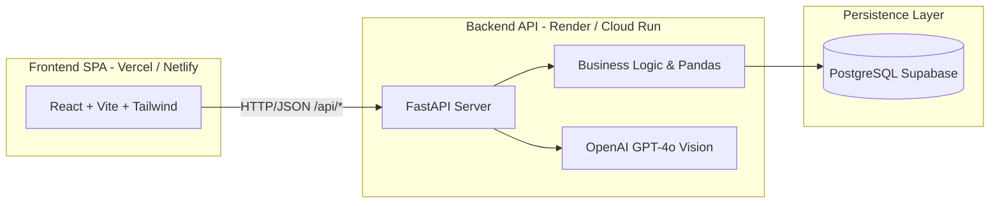

# ARCHITECTURE.md — FuelPyTracker v2.0

> **Destinatari:** Tech Lead, Recruiter tecnici, Full-Stack Developer Onboarding.  
> Questo documento traccia l'evoluzione ingegneristica di FuelPyTracker verso la **Versione 2.0**: il passaggio strategico da un'applicazione monolitica basata su Streamlit a un'architettura **completamente disaccoppiata (Headless)**, ad alte prestazioni, basata su **FastAPI** e **React**.

---

## 🎯 1. La Visione della V2: Perché la Migrazione Headless

### Il contesto di partenza (v1.x)
La prima versione di FuelPyTracker (v1.0 - v1.1.0) è stata costruita adottando **Streamlit**. Questa scelta ha permesso di validare rapidamente l'idea di business e consolidare oltre 1.500 righe di logica analitica solida:
- Calcolo dei consumi con algoritmo *Full-to-Full*.
- Analisi cronologica dei chilometri e individuazione delle anomalie.
- Integrazione dell'OCR multimodale con OpenAI GPT-4o per la lettura scontrini.
- Esportazione avanzata in PDF ed Excel.

### I colli di bottiglia di Streamlit
Man mano che l'applicazione è cresciuta, i vincoli strutturali del paradigma monolitico di Streamlit sono emersi con chiarezza:
1. **Ciclo di vita effimero (Script Re-run):** Ad ogni interazione utente (un clic, una selezione, un tasto premuto), l'intero script Python viene rieseguito dall'inizio alla fine. Ciò impone una gestione complessa e fragile dello stato in memoria (`st.session_state`) e genera latenze percepite.
2. **Assenza di Routing nativo:** Streamlit non espone URL semantici per pagina (es. `/dashboard`, `/fuel`, `/maintenance`), costringendo a un routing artigianale tramite pulsanti e dizionari di funzioni.
3. **User Experience rigida:** Impossibilità di gestire micro-interazioni moderne, transizioni fluide, skeleton loaders durante il caricamento e layout realmente responsive ottimizzati per smartphone.
4. **Footprint di memoria e costi:** Un processo Streamlit mantiene in memoria il rendering grafico e i dati, rendendo l'hosting gratuito soggetto a crash per memoria esaurita o a continui riavvii.

### La decisione architetturale: Disaccoppiamento Totale
La Versione 2.0 adotta un'architettura **Frontend/Backend disaccoppiata**:
- **Backend (FastAPI):** Mantiene il codice Python per non riscrivere la preziosa logica dati, ma si trasforma in un server API REST puro, leggerissimo e asincrono.
- **Frontend (React + Vite + TailwindCSS + Shadcn/UI):** Una Single Page Application (SPA) ultra-veloce, compilata staticamente su CDN Edge globale, con rendering interamente client-side.
- **Obiettivo Hosting a Costo Zero (Zero-Cost Hosting):** Il frontend vive gratuitamente su CDN (Vercel o Netlify) con caricamento istantaneo (TTFB < 50ms); il backend vive su un PaaS gratuito (Render o Cloud Run) ottimizzato per ridurre al minimo i consumi.



---

## 🌿 2. La Strategia di Transizione: Il Pattern "Strangler Fig"

Per migrare l'applicazione senza fermare la produzione né incorrere nei rischi del "Big Bang rewrite", abbiamo adottato il pattern **Strangler Fig (il Fico Strangolatore)**:
- Il nuovo backend FastAPI non viene sviluppato in un repository separato al buio, ma **germoglia all'interno dello stesso repository**, incapsulando progressivamente la logica e i moduli già collaudati (`src/services/`, `src/database/`).
- **Nessun downtime e verifica comparativa:** Durante tutte le fasi di sviluppo della V2, l'applicazione Streamlit v1.1.0 continua a funzionare regolarmente. Questo offre il vantaggio inestimabile di poter confrontare in tempo reale i risultati forniti dalle nuove API con l'output della vecchia interfaccia grafica.

---

## 🏛️ 3. Fase 1: Riorganizzazione Architetturale (Il Monorepo)

La prima fase esecutiva ha trasformato il repository da un monolite disordinato a un **Monorepo Organizzato**, preparando il terreno per accogliere i due silos indipendenti: `backend/` e `frontend/`.

### Struttura delle Directory

```text
FuelPyTracker/
├── backend/                       <-- Silo Backend Python
│   ├── .streamlit/                <-- Configurazioni runtime legacy
│   │   ├── config.toml
│   │   └── secrets.toml.example
│   ├── src/
│   │   ├── api/                   <-- [NUOVO] Motore REST FastAPI
│   │   │   ├── config.py          <-- Setup ambiente e CORS
│   │   │   ├── deps.py            <-- Dependency Injection e autenticazione
│   │   │   ├── server.py          <-- Entrypoint FastAPI & Uvicorn
│   │   │   ├── routers/           <-- Endpoint suddivisi per dominio
│   │   │   └── schemas/           <-- Contratti dati Pydantic
│   │   ├── database/              <-- SQLAlchemy Core, Models, CRUD
│   │   ├── services/              <-- Business logic (Fuel, Calc, OCR)
│   │   └── ui/                    <-- Schermate Streamlit legacy (in dismissione)
│   ├── tests/                     <-- Suite pytest unificata
│   ├── Dockerfile                 <-- Dockerfile per il container backend
│   ├── main.py                    <-- Entrypoint Streamlit V1
│   └── requirements.txt           <-- Dipendenze Python (FastAPI + Uvicorn)
├── frontend/                      <-- [Fase 3] Silo React + Vite + Tailwind
├── docs/                          <-- Documentazione ufficiale di progetto
│   ├── ARCHITECTURE.md            <-- Documentazione V1 (Streamlit)
│   └── v2/                        <-- [NUOVO] Documentazione ufficiale V2
│       ├── ARCHITECTURE.md        <-- Questo documento
│       └── SETUP_GUIDE.md         <-- Guida avvio e configurazione V2
├── _cantiere/                     <-- Area di lavoro e roadmap temporanea
└── docker-compose.yml             <-- Orchestrazione container locale
```

### Adeguamento del Contesto Docker
Il file `docker-compose.yml` è rimasto nella radice del repository per consentire l'orchestrazione con un solo comando, ma il contesto di build è stato aggiornato puntando a `./backend`:
```yaml
services:
  app:
    build:
      context: ./backend
      dockerfile: Dockerfile
```

---

## ⚡ 4. Il Motore API: FastAPI & Uvicorn

Nella Fase 1 abbiamo introdotto **FastAPI** come cuore pulsante del backend:

### Perché FastAPI?
1. **Velocità e Asincronia:** Basato sullo standard **ASGI** e alimentato da **Uvicorn**, garantisce un throughput di richieste incomparabilmente superiore a qualsiasi framework sincrono tradizionale.
2. **Contratti Dati Nativi (Pydantic):** Validazione automatica e serializzazione istantanea di ogni richiesta e risposta HTTP. Se il client invia un dato errato o mancante, FastAPI risponde con un messaggio di errore chiaro (HTTP 422) senza toccare la logica interna.
3. **Documentazione OpenAPI Autogenerata:** FastAPI analizza il codice Python e i tipi definiti, generando automaticamente la specifica OpenAPI e l'interfaccia interattiva **Swagger UI**.

### Configurazione CORS
Per consentire al futuro client React (in esecuzione su domini diversi come `localhost:5173` o sul dominio di produzione Vercel) di comunicare senza blocchi di sicurezza da parte dei browser, abbiamo integrato il middleware `CORSMiddleware`:
```python
app.add_middleware(
    CORSMiddleware,
    allow_origins=CORS_ORIGINS,
    allow_credentials=True,
    allow_methods=["*"],
    allow_headers=["*"],
)
```

---

## 🧊 5. Mitigazione del Cold Start (Strategia Zero-Cost Hosting)

Una delle sfide più critiche nell'ospitare backend gratuiti su piattaforme PaaS moderne (come Render, Railway o Fly.io) è il fenomeno del **Server Sleep**:
- Dopo 10-15 minuti di inattività, il container viene spento per risparmiare risorse.
- Alla richiesta successiva dell'utente, il server deve riavviarsi da zero (*Cold Start*), introducendo una latenza che può variare dai 30 ai 50 secondi.

### La soluzione architetturale: `GET /health`
Abbiamo implementato fin dalla Fase 1 un endpoint strategico ultra-leggero e non autenticato:
```python
@app.get("/health", tags=["System"])
def health_check():
    return {
        "status": "ok",
        "version": "2.0.0",
        "timestamp": datetime.datetime.utcnow().isoformat()
    }
```
**Come funziona la mitigazione:**
Un servizio di monitoraggio uptime esterno e gratuito (es. **UptimeRobot**, cron-job di GitHub Actions o BetterStack) invia una richiesta HTTP leggera a `/health` ogni 10 minuti. Questo "battito cardiaco" costante impedisce al server di addormentarsi, azzerando i tempi di attesa per l'utente finale a costo zero.

---

## 📖 6. Documentazione Interattiva e Developer Experience (Swagger UI)

Una delle priorità della Fase 1 è stata l'azzeramento della frizione per sviluppatori e tester:
- **Swagger UI** è attivo e raggiungibile all'indirizzo `/docs` (es. `http://localhost:8000/docs`). Da qui è possibile esplorare tutti gli endpoint, leggere gli schemi dei dati e testare le chiamate in tempo reale cliccando su *"Try it out"*.
- **Redirect automatico dalla root (`/`):** Per evitare schermate `404 Not Found` digitando semplicemente l'indirizzo base `http://localhost:8000`, abbiamo implementato un reindirizzamento automatico permanente verso `/docs`:
  ```python
  @app.get("/", include_in_schema=False)
  def root():
      return RedirectResponse(url="/docs")
  ```

---

## 🗺️ 7. Roadmap Tecnica di Completamento V2

| Fase | Titolo | Obiettivo Principale | Stato |
| :--- | :--- | :--- | :--- |
| **Fase 1** | **Infrastruttura Backend API** | Monorepo `backend/`, FastAPI, Uvicorn, `/health`, CORS, Swagger UI | ✅ **Completata** |
| **Fase 2** | **Contratti Dati & Endpoint REST** | Disaccoppiamento DB, router Auth, Fuel + OCR, Maintenance, Dashboard | 🔄 **In corso** |
| **Fase 3** | **Bootstrap Frontend (React)** | Setup Vite, TailwindCSS, Shadcn/UI, routing SPA, TanStack Query | ⏳ Pianificata |
| **Fase 4** | **Ricostruzione Interfaccia UX** | Pagine React, cruscotti analitici, modal d'inserimento, gestione responsive | ⏳ Pianificata |
| **Fase 5** | **Deploy CI/CD & Dismissione V1** | Deploy Vercel (Frontend), Render (Backend), archiviazione branch V1 | ⏳ Pianificata |
