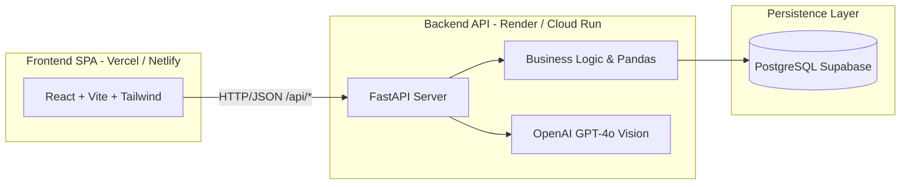
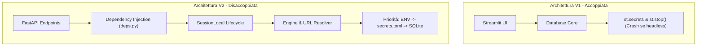
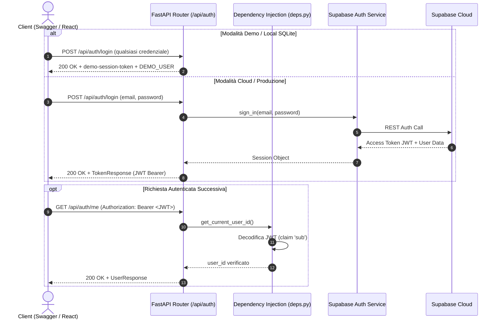

# ARCHITECTURE.md — FuelPyTracker v2.0

> **Destinatari:** Tech Lead, Recruiter tecnici, Full-Stack Developer Onboarding.  
> Questo documento traccia l'evoluzione ingegneristica di FuelPyTracker verso la **Versione 2.0**: il passaggio strategico da un'applicazione monolitica basata su Streamlit a un'architettura **completamente disaccoppiata (Headless)**, ad alte prestazioni, basata su **FastAPI** e **React**.

---

## 🎯 1. La Visione della V2: Perché la Migrazione Headless

### Il contesto di partenza (v1.x)
La prima versione di FuelPyTracker (v1.0 - v1.1.0) è stata costruita adottando **Streamlit**. Questa scelta ha permesso di validare rapidamente l'idea di business e consolidare oltre 1.500 righe di logica analitica solida:
- Calcolo dei consumi con algoritmo *Full-to-Full*.
- Analisi cronologica dei chilometri e individuazione delle anomalie.
- Integrazione dell'OCR multimodale con OpenAI GPT-4o per la lettura scontrini.
- Esportazione avanzata in PDF ed Excel.

### I colli di bottiglia di Streamlit
Man mano che l'applicazione è cresciuta, i vincoli strutturali del paradigma monolitico di Streamlit sono emersi con chiarezza:
1. **Ciclo di vita effimero (Script Re-run):** Ad ogni interazione utente (un clic, una selezione, un tasto premuto), l'intero script Python viene rieseguito dall'inizio alla fine. Ciò impone una gestione complessa e fragile dello stato in memoria (`st.session_state`) e genera latenze percepite.
2. **Assenza di Routing nativo:** Streamlit non espone URL semantici per pagina (es. `/dashboard`, `/fuel`, `/maintenance`), costringendo a un routing artigianale tramite pulsanti e dizionari di funzioni.
3. **User Experience rigida:** Impossibilità di gestire micro-interazioni moderne, transizioni fluide, skeleton loaders durante il caricamento e layout realmente responsive ottimizzati per smartphone.
4. **Footprint di memoria e costi:** Un processo Streamlit mantiene in memoria il rendering grafico e i dati, rendendo l'hosting gratuito soggetto a crash per memoria esaurita o a continui riavvii.

### La decisione architetturale: Disaccoppiamento Totale
La Versione 2.0 adotta un'architettura **Frontend/Backend disaccoppiata**:
- **Backend (FastAPI):** Mantiene il codice Python per non riscrivere la preziosa logica dati, ma si trasforma in un server API REST puro, leggerissimo e asincrono.
- **Frontend (React + Vite + TailwindCSS + Shadcn/UI):** Una Single Page Application (SPA) ultra-veloce, compilata staticamente su CDN Edge globale, con rendering interamente client-side.
- **Obiettivo Hosting a Costo Zero (Zero-Cost Hosting):** Il frontend vive gratuitamente su CDN (Vercel o Netlify) con caricamento istantaneo (TTFB < 50ms); il backend vive su un PaaS gratuito (Render o Cloud Run) ottimizzato per ridurre al minimo i consumi.



---

## 🌿 2. La Strategia di Transizione: Il Pattern "Strangler Fig"

Per migrare l'applicazione senza fermare la produzione né incorrere nei rischi del "Big Bang rewrite", abbiamo adottato il pattern **Strangler Fig (il Fico Strangolatore)**:
- Il nuovo backend FastAPI non viene sviluppato in un repository separato al buio, ma **germoglia all'interno dello stesso repository**, incapsulando progressivamente la logica e i moduli già collaudati (`src/services/`, `src/database/`).
- **Nessun downtime e verifica comparativa:** Durante tutte le fasi di sviluppo della V2, l'applicazione Streamlit v1.1.0 continua a funzionare regolarmente. Questo offre il vantaggio inestimabile di poter confrontare in tempo reale i risultati forniti dalle nuove API con l'output della vecchia interfaccia grafica.

---

## 🏛️ 3. Fase 1: Riorganizzazione Architetturale (Il Monorepo)

La prima fase esecutiva ha trasformato il repository da un monolite disordinato a un **Monorepo Organizzato**, preparando il terreno per accogliere i due silos indipendenti: `backend/` e `frontend/`.

### Struttura delle Directory

```text
FuelPyTracker/
├── backend/                       <-- Silo Backend Python
│   ├── .streamlit/                <-- Configurazioni runtime legacy
│   │   ├── config.toml
│   │   └── secrets.toml.example
│   ├── src/
│   │   ├── api/                   <-- [NUOVO] Motore REST FastAPI
│   │   │   ├── config.py          <-- Setup ambiente e CORS
│   │   │   ├── deps.py            <-- Dependency Injection e autenticazione
│   │   │   ├── server.py          <-- Entrypoint FastAPI & Uvicorn
│   │   │   ├── routers/           <-- Endpoint suddivisi per dominio
│   │   │   └── schemas/           <-- Contratti dati Pydantic
│   │   ├── database/              <-- SQLAlchemy Core, Models, CRUD
│   │   ├── services/              <-- Business logic (Fuel, Calc, OCR)
│   │   └── ui/                    <-- Schermate Streamlit legacy (in dismissione)
│   ├── tests/                     <-- Suite pytest unificata
│   ├── Dockerfile                 <-- Dockerfile per il container backend
│   ├── main.py                    <-- Entrypoint Streamlit V1
│   └── requirements.txt           <-- Dipendenze Python (FastAPI + Uvicorn)
├── frontend/                      <-- [Fase 3] Silo React + Vite + Tailwind
├── docs/                          <-- Documentazione ufficiale di progetto
│   ├── ARCHITECTURE.md            <-- Documentazione V1 (Streamlit)
│   └── v2/                        <-- [NUOVO] Documentazione ufficiale V2
│       ├── ARCHITECTURE.md        <-- Questo documento
│       └── SETUP_GUIDE.md         <-- Guida avvio e configurazione V2
├── _cantiere/                     <-- Area di lavoro e roadmap temporanea
└── docker-compose.yml             <-- Orchestrazione container locale
```

### Adeguamento del Contesto Docker
Il file `docker-compose.yml` è rimasto nella radice del repository per consentire l'orchestrazione con un solo comando, ma il contesto di build è stato aggiornato puntando a `./backend`:
```yaml
services:
  app:
    build:
      context: ./backend
      dockerfile: Dockerfile
```

---

## ⚡ 4. Il Motore API: FastAPI & Uvicorn

Nella Fase 1 abbiamo introdotto **FastAPI** come cuore pulsante del backend:

### Perché FastAPI?
1. **Velocità e Asincronia:** Basato sullo standard **ASGI** e alimentato da **Uvicorn**, garantisce un throughput di richieste incomparabilmente superiore a qualsiasi framework sincrono tradizionale.
2. **Contratti Dati Nativi (Pydantic):** Validazione automatica e serializzazione istantanea di ogni richiesta e risposta HTTP. Se il client invia un dato errato o mancante, FastAPI risponde con un messaggio di errore chiaro (HTTP 422) senza toccare la logica interna.
3. **Documentazione OpenAPI Autogenerata:** FastAPI analizza il codice Python e i tipi definiti, generando automaticamente la specifica OpenAPI e l'interfaccia interattiva **Swagger UI**.

### Configurazione CORS
Per consentire al futuro client React (in esecuzione su domini diversi come `localhost:5173` o sul dominio di produzione Vercel) di comunicare senza blocchi di sicurezza da parte dei browser, abbiamo integrato il middleware `CORSMiddleware`:
```python
app.add_middleware(
    CORSMiddleware,
    allow_origins=CORS_ORIGINS,
    allow_credentials=True,
    allow_methods=["*"],
    allow_headers=["*"],
)
```

---

## 🧊 5. Mitigazione del Cold Start (Strategia Zero-Cost Hosting)

Una delle sfide più critiche nell'ospitare backend gratuiti su piattaforme PaaS moderne (come Render, Railway o Fly.io) è il fenomeno del **Server Sleep**:
- Dopo 10-15 minuti di inattività, il container viene spento per risparmiare risorse.
- Alla richiesta successiva dell'utente, il server deve riavviarsi da zero (*Cold Start*), introducendo una latenza che può variare dai 30 ai 50 secondi.

### La soluzione architetturale: `GET /health`
Abbiamo implementato fin dalla Fase 1 un endpoint strategico ultra-leggero e non autenticato:
```python
@app.get("/health", tags=["System"])
def health_check():
    return {
        "status": "ok",
        "version": "2.0.0",
        "timestamp": datetime.datetime.utcnow().isoformat()
    }
```
**Come funziona la mitigazione:**
Un servizio di monitoraggio uptime esterno e gratuito (es. **UptimeRobot**, cron-job di GitHub Actions o BetterStack) invia una richiesta HTTP leggera a `/health` ogni 10 minuti. Questo "battito cardiaco" costante impedisce al server di addormentarsi, azzerando i tempi di attesa per l'utente finale a costo zero.

---

## 📖 6. Documentazione Interattiva e Developer Experience (Swagger UI)

Una delle priorità della Fase 1 è stata l'azzeramento della frizione per sviluppatori e tester:
- **Swagger UI** è attivo e raggiungibile all'indirizzo `/docs` (es. `http://localhost:8000/docs`). Da qui è possibile esplorare tutti gli endpoint, leggere gli schemi dei dati e testare le chiamate in tempo reale cliccando su *"Try it out"*.
- **Redirect automatico dalla root (`/`):** Per evitare schermate `404 Not Found` digitando semplicemente l'indirizzo base `http://localhost:8000`, abbiamo implementato un reindirizzamento automatico permanente verso `/docs`:
  ```python
  @app.get("/", include_in_schema=False)
  def root():
      return RedirectResponse(url="/docs")
  ```

---

## 🔌 7. Fase 2.1: Fondamenta Core, Disaccoppiamento DB e Dependency Injection

La transizione verso un'architettura Headless ha richiesto di affrontare il debito di accoppiamento accumulato nella V1, dove il motore di persistenza dei dati era saldato alle primitive grafiche di Streamlit.

### Il Problema: L'accoppiamento con il runtime di Streamlit
Nel codice originale di `src.database.core`:
- La stringa di connessione veniva prelevata unicamente da `st.secrets["database"]["url"]`.
- In caso di database non raggiungibile o credenziali mancanti, il codice invocava direttamente `st.error()` (per disegnare l'alert box a schermo) e `st.stop()` (per congelare il thread di rendering).

All'interno di un server web headless come FastAPI, l'invocazione di queste funzioni sollevava eccezioni critiche (`ScriptRunContext missing` o `StreamlitSecretNotFoundError`), mandando in crash l'intero processo all'avvio.



### La Soluzione: Risoluzione Resiliente dell'URL (`url.py`)
Abbiamo introdotto una gerarchia di risoluzione dell'URL di connessione totalmente autonoma:
1. **Variabile d'ambiente OS (`DATABASE_URL`):** Massima priorità. Gestisce in automatico anche la normalizzazione del prefisso legacy `postgres://` in `postgresql://` (necessario per SQLAlchemy su piattaforme come Render ed Heroku).
2. **Flag `LOCAL_SQLITE=True`:** Modalità sandbox per bootstrap immediato senza cloud (`sqlite:///data/local.db`).
3. **Parametro esplicito (`secrets_url`):** Utilizzato da Streamlit o da chiamanti specifici.
4. **File locale `secrets.toml`:** Letto direttamente tramite parser TOML senza dipendere dal framework grafico.

In `core.py`, la funzione `_is_streamlit_running()` rileva dinamicamente il contesto: se l'app gira sotto Streamlit mostra gli avvisi grafici V1; se gira sotto FastAPI solleva normali eccezioni Python e produce log strutturati.

### Dependency Injection e Gestione della Sessione (`deps.py`)
FastAPI adotta il pattern della **Dependency Injection** per garantire l'isolamento e la scalabilità:

```python
def get_db() -> Generator[Session, None, None]:
    """
    Fornisce una sessione SQLAlchemy isolata per singola richiesta HTTP.
    Garantisce la chiusura pulita (db.close()) nel blocco finally.
    """
    db = SessionLocal()
    try:
        yield db
    finally:
        db.close()
```

- **Prevenzione dei Memory Leak:** La sessione viene aperta al momento dell'ingresso nella route e chiusa in modo garantito al termine della risposta, evitando il consumo incontrollato del pool di connessioni su PostgreSQL.
- **Autenticazione Trasparente (`get_current_user_id`):** 
  - Estrae e valida il token Bearer JWT di Supabase (recuperando l'UUID dal claim `sub`).
  - Supporta l'header `X-User-Id` per semplificare i test automatici.
  - Esegue il fallback trasparente sull'utente demo (`DEMO_USER_ID`) quando l'ambiente è configurato in Sandbox o SQLite locale, permettendo di testare tutte le API direttamente da Swagger UI senza login preventivo.
  - Blocca gli accessi non autorizzati in ambiente di produzione con HTTP 401.

### Configurazione Centralizzata (`config.py`)
Il modulo `src.api.config` incapsula il caricamento di `.env` (cercando sia nella cartella `backend/` che nella radice del progetto) ed espone costanti tipizzate per le API (`API_TITLE`, `API_VERSION`, `CORS_ORIGINS`, `DEMO_MODE`).

---

## 🔐 8. Fase 2.2: Autenticazione, Contratti Dati Pydantic e Router /api/auth

La Fase 2.2 ha introdotto il primo dominio funzionale della V2: la gestione dell'identità utente, l'emissione di token JWT e la standardizzazione dei contratti dati.

### I Contratti Dati Pydantic (`schemas/auth.py`)
In un'architettura disaccoppiata, il server API deve garantire che i dati scambiati rispettino vincoli rigorosi di forma e tipo. Abbiamo adottato **Pydantic v2** per definire i contratti dati (DTO) di input e output:

- **`LoginRequest` / `RegisterRequest`:** Validazione formale dell'email tramite `EmailStr` (alimentato dalla libreria `email-validator`) e vincolo di sicurezza sulla lunghezza minima della password (`Field(..., min_length=6)`).
- **`UserResponse`:** Espone solo le informazioni necessarie al frontend (`id`, `email`, `is_demo`), escludendo metadati sensibili.
- **`TokenResponse`:** Modella la sessione di autenticazione (`access_token`, `token_type: "bearer"`, `user: UserResponse`).
- **`PasswordResetRequest` & `MessageResponse`:** Strutture standardizzate per flussi di ripristino credenziali e messaggi informativi.

*Vantaggio architetturale:* Se un client invia un payload malformato, FastAPI intercetta l'errore a monte e risponde automaticamente con un codice **HTTP 422 Unprocessable Entity** e una spiegazione dettagliata, impedendo al dato non valido di raggiungere i servizi di backend.

### Disaccoppiamento di Supabase Auth (`services/auth/auth_service.py`)
Nella V1, l'istanza del client Supabase era legata a doppio filo a `st.session_state` e `st.secrets`:
- Abbiamo introdotto la funzione `_get_supabase_credentials()` che preleva le chiavi da variabili d'ambiente (`SUPABASE_URL`, `SUPABASE_KEY`) o dal file `secrets.toml` tramite parser nativo.
- `get_client()` opera ora in modo polimorfico: in Streamlit preserva l'isolamento della sessione in memoria per utente; fuori da Streamlit (FastAPI e worker) crea client stateless ad alte prestazioni.



### Gli Endpoint del Router `/api/auth`
Il modulo `src.api.routers.auth` espone 5 route RESTful integrate in `server.py`:
1. **`POST /api/auth/login`**: Autentica l'utente e restituisce il token JWT; in modalità Demo rilascia un token immediato consentendo il testing istantaneo.
2. **`POST /api/auth/register`**: Registrazione di un nuovo account (HTTP 201 Created).
3. **`POST /api/auth/logout`**: Terminazione della sessione e pulizia token.
4. **`GET /api/auth/me`**: Restituisce il profilo dell'utente autenticato utilizzando la dependency injection `get_current_user_id`.
5. **`POST /api/auth/reset-password`**: Inoltro della richiesta di ripristino password via email.

---

## 🗺️ 9. Roadmap Tecnica di Completamento V2

| Fase | Titolo | Obiettivo Principale | Stato |
| :--- | :--- | :--- | :--- |
| **Fase 1** | **Infrastruttura Backend API** | Monorepo `backend/`, FastAPI, Uvicorn, `/health`, CORS, Swagger UI | ✅ **Completata** |
| **Fase 2.1**| **Fondamenta Core & Isolamento DB** | Disaccoppiamento database da Streamlit, `deps.py`, DI sessione, config | ✅ **Completata** |
| **Fase 2.2**| **Auth & Schemi Base** | Schemi Pydantic auth, Supabase Auth disaccoppiato, router `/api/auth` | ✅ **Completata** |
| **Fase 2.3**| **Dominio Fuel & OCR** | Schemi e CRUD rifornimenti, calcoli consumo, pipeline OCR scontrini | 🔄 **In corso** |
| **Fase 2.4**| **Dashboard & Maintenance** | Endpoint aggregati KPI, grafici, gestione tagliandi e promemoria | ⏳ Pianificata |
| **Fase 2.5**| **Settings & Reports** | Preferenze utente, export PDF e fogli Excel | ⏳ Pianificata |
| **Fase 3** | **Bootstrap Frontend (React)** | Setup Vite, TailwindCSS, Shadcn/UI, routing SPA, TanStack Query | ⏳ Pianificata |
| **Fase 4** | **Ricostruzione Interfaccia UX** | Pagine React, cruscotti analitici, modal d'inserimento, responsive | ⏳ Pianificata |
| **Fase 5** | **Deploy CI/CD & Dismissione V1** | Deploy Vercel (Frontend), Render (Backend), archiviazione branch V1 | ⏳ Pianificata |


