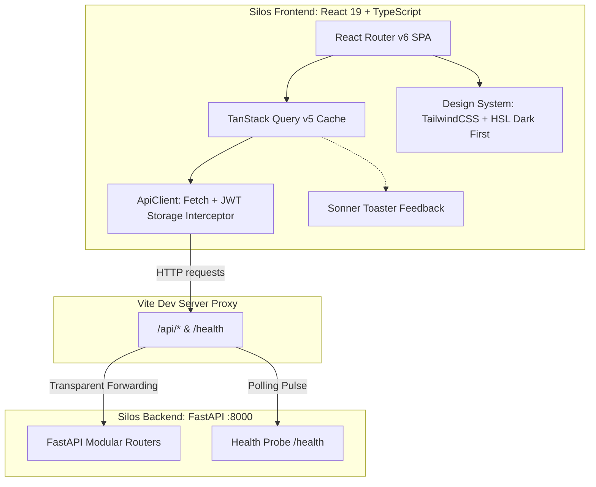

# Architettura Frontend V2.0 (React + Vite + TailwindCSS + Shadcn/UI)

Questo documento costituisce il **riferimento architetturale ufficiale per il silos client-side** (`frontend/`) di FuelPyTracker V2.0.
Traccia in modo persistente e modulare tutte le decisioni tecniche, i contratti dati, il design system e lo stato di avanzamento della **Fase 3 (Bootstrap)** e della **Fase 4 (Ricostruzione Interfaccia UX)**.

---

## 🏛️ 1. Visione Architetturale del Client

Il frontend è un'applicazione web autonoma di tipo **Single Page Application (SPA)** progettata per offrire un'esperienza d'uso moderna, fluida e reattiva, azzerando i tempi di caricamento e superando i limiti del vecchio monolite Streamlit.



### Struttura delle Directory (`frontend/`)
```text
frontend/
├── index.html                # Entry HTML con meta-tag, SEO e Google Fonts (Outfit, Inter)
├── package.json              # Script npm e dipendenze (React 19, Recharts, Zod, Radix, Lucide)
├── tsconfig.app.json         # Alias @/* -> ./src/* con compatibilità TypeScript 6.0
├── vite.config.ts            # Bundler Vite con reverse proxy per /api e /health -> :8000
├── tailwind.config.js        # Design tokens HSL, tailwindcss-animate e breakpoint responsive
├── postcss.config.js         # Pipeline PostCSS + Autoprefixer
└── src/
    ├── main.tsx              # Entry point React
    ├── App.tsx               # Root component con QueryClientProvider, Router e Toaster
    ├── index.css             # Tailwind base/utilities e variabili CSS HSL (Dark Mode First)
    ├── lib/
    │   └── utils.ts          # Helper cn() per merging classi condizionali (clsx + twMerge)
    ├── types/                # Contratti DTO TypeScript sincronizzati 1:1 con Pydantic
    │   ├── auth.ts
    │   ├── dashboard.ts
    │   ├── fuel.ts
    │   ├── maintenance.ts
    │   ├── reminders.ts
    │   ├── settings.ts
    │   ├── reports.ts
    │   ├── system.ts
    │   └── index.ts          # Central re-export
    ├── services/api/         # Livello di trasporto HTTP centralizzato
    │   ├── client.ts         # Wrapper fetch con JWT Bearer e classe personalizzata ApiError
    │   ├── systemApi.ts      # Health check probe
    │   ├── dashboardApi.ts   # KPI summary, serie temporali e trip calculator
    │   └── fuelApi.ts        # Operazioni CRUD e validazione pre-flight chilometrica
    ├── hooks/                # Hook personalizzati TanStack Query
    │   ├── useSystemHealth.ts# Polling live dello stato del server (15s)
    │   └── useDashboardSummary.ts # Cache reattiva dati cruscotto
    ├── components/
    │   ├── ui/               # Primitive Shadcn/UI (Button, Card, Badge, Input, Skeleton, Dialog, Sheet, Tabs, Table, Toaster)
    │   └── layout/           # AppLayout, Sidebar (collassabile/responsive) e Navbar
    └── pages/                # Viste di dominio SPA
        ├── DashboardPage.tsx
        ├── FuelPage.tsx
        ├── MaintenancePage.tsx
        ├── RemindersPage.tsx
        ├── ReportsPage.tsx
        ├── SettingsPage.tsx
        ├── LoginPage.tsx
        └── NotFoundPage.tsx
```

---

## 🚀 2. Fase 3: Bootstrap Frontend (Fondamenta Client)

Completata con successo, la Fase 3 ha realizzato:

1. **Design System Dark Mode First:**
   - Variabili CSS semantiche HSL (`--background: 222 47% 8%`, `--card: 222 47% 11%`, smeraldo `--primary: 158 75% 48%`, ambra per alert e rosa per scadenze).
   - Tipografia premium con Google Fonts (*Outfit* per titoli e brand, *Inter* per testi e tabelle).
2. **Componenti UI Atomici Base:**
   - `Button`: con varianti semantiche (`default`, `emerald`, `secondary`, `outline`, `ghost`, `destructive`), taglie e supporto `asChild`.
   - `Card`: primitives componibili (`CardHeader`, `CardTitle`, `CardDescription`, `CardContent`, `CardFooter`).
   - `Badge`: pillole di stato (`success`, `warning`, `destructive`, `info`, `outline`).
   - `Input`: campi accessibili con outline ring e sfondi dark.
   - `Skeleton`: animazioni a pulsazione (`animate-pulse`) per prevenire layout shifting durante il caricamento asincrono.
3. **Shell di Navigazione SPA (`AppLayout`):**
   - `Sidebar`: desktop collassabile con toggle button, drawer responsive mobile, icone Lucide, badge di conteggio e scheda veicolo attivo (*BMW Serie 1*).
   - `Navbar`: breadcrumb dinamico sincronizzato a `useLocation()`, quick action (*Nuovo Rifornimento*) e indicatore in tempo reale dello stato del backend (*FastAPI Online* con pulse verde).
   - 8 viste scheletriche collegate tramite `react-router-dom`.
4. **Trasporto HTTP & Contratti Dati:**
   - Contratti DTO TypeScript in `src/types/` sincronizzati 1:1 con i modelli Pydantic.
   - Client HTTP unificato con iniezione JWT Bearer e gestione reverse proxy Vite (`/api` e `/health` -> `127.0.0.1:8000`).
   - TanStack Query v5 globale con polling periodico `/health` (15s) e cache a 30s.

---

## 🎨 3. Fase 4: Ricostruzione Interfaccia UX & Componenti

La **Fase 4** trasforma lo scheletro in un'applicazione interattiva completa, fruibile con massima ergonomia sia da desktop sia da smartphone.

### 🔹 Sotto-Fase 4.1: UI Kit Esteso, Form & Librerie Specializzate ✅
- **Pacchetti Integrati:**
  - `recharts`: libreria per grafici interattivi e serie temporali.
  - `react-hook-form` + `@hookform/resolvers` + `zod`: gestione e validazione immediata dei form.
  - `sonner`: sistema di notifiche toast con styling dark ad alto contrasto.
  - `@radix-ui/react-dialog` & `@radix-ui/react-tabs`: primitive accessibili per popup, cassetti e schede.
  - `date-fns`: formattazione temporale localizzata in italiano.
  - `tailwindcss-animate`: animazioni fluide di ingresso e uscita per finestre e cassetti.
- **Componenti UI Creati:**
  - `src/components/ui/dialog.tsx`: finestra modale con sfondo oscurato sfocato, focus trapping e chiusura con tasto ESC.
  - `src/components/ui/sheet.tsx`: cassetto scorrevole laterale (*Side Inspector*) e cassetto dal basso (*Bottom Sheet* per smartphone).
  - `src/components/ui/tabs.tsx`: navigatore a schede per alternare viste e grafici.
  - `src/components/ui/table.tsx`: set di componenti per tabelle dati ad alta densità.
  - `src/components/ui/sonner.tsx`: wrapper Toaster integrato globalmente in `src/App.tsx`.
- **Showcase Interattivo:**
  - Integrato in `src/pages/SettingsPage.tsx` un pannello di collaudo per testare in tempo reale notifiche toast, modali Dialog, cassetti Sheet e Tabs.
### 🔹 Sotto-Fase 4.2: Shell Adattiva, Bottom Navigation Bar Mobile & Pulsante FAB Centrale ✅
- **Bottom Navigation Bar (`src/components/layout/BottomBar.tsx`):**
  - Barra di navigazione fissa a fondo schermo per dispositivi mobili (`md:hidden`) con effetto glassmorphism scuro e ombreggiatura superiore (`shadow-[0_-4px_20px_rgba(0,0,0,0.3)]`).
  - Tab 1: **Dashboard** (`/`).
  - Tab 2: **Pieni / Rifornimenti** (`/fuel`).
  - **Pulsante FAB Centrale (+):** pulsante circolare sopraelevato ad alto contrasto smeraldo (`from-emerald-400 to-emerald-600`) con ring di stacco e micro-interazione al tocco (`active:scale-95`), per registrare un nuovo pieno comodamente con una mano.
  - Tab 3: **Officina / Manutenzioni** (`/maintenance`).
  - Tab 4: **Altro (Menu a cassetto):** apre un Bottom Sheet fluido che racchiude *Scadenze & Promemoria* (con badge notifiche), *Report & Esportazioni*, *Impostazioni Sistema*, *Profilo Utente* e la scheda del veicolo attivo (*BMW Serie 1*).
- **Header Adattivo (`src/components/layout/Navbar.tsx`):**
  - Mobile: compatto con icona brand smeraldo, titolo sintetico e badge FastAPI compatto con pulse verde.
  - Desktop: breadcrumbs completi, pulsante rapido "+ Nuovo Rifornimento" e profilo utente.
- **Layout Unificato (`src/components/layout/AppLayout.tsx`):**
  - Aggiunto padding inferiore dinamico (`pb-24 md:pb-8`) al contenitore `<main>` per evitare qualsiasi sovrapposizione tra i contenuti e la barra inferiore su schermi touch.
- **Esito Collaudo:** `npm run lint` 0 errori e 0 warning su 43 file; `npm run build` completato in 1.21s.

### 🔹 Sotto-Fase 4.3: Dashboard Reattiva, KPI Live, Grafici Recharts, Car Health Score & Calcolatore Viaggio ✅
- **4 KPI Card Dinamiche (`src/pages/DashboardPage.tsx`):**
  - Consumo Medio Storico (`L/100km` e `km/L`) con badge trend efficienza.
  - Spesa Carburante Totale (€) con conteggio dei rifornimenti registrati.
  - Spesa Manutenzioni Totale (€) per ricambi e interventi d'officina.
  - Allarme Rifornimenti Parziali condizionale (`partial_alert`) che si attiva con avviso dorato solo in caso di spesa parziale accumulata oltre soglia.
- **Grafici Interattivi Recharts (`src/components/dashboard/DashboardCharts.tsx`):**
  - Scheda 1: *Andamento Prezzi Carburante* (€/L nel tempo con AreaChart a gradiente smeraldo).
  - Scheda 2: *Efficienza Energetica* (km/L per ogni pieno con AreaChart ciano e media storica tratteggiata).
  - Scheda 3: *Spesa Mensile Comparata* (BarChart a barre affiancate/sovrapposte: Carburante vs Manutenzioni).
  - Filtri Temporali Interattivi: selettore rapido `3M`, `6M`, `1A`, `Tutto` con ricaricamento reattivo.
  - Custom Dark Tooltip: tooltip semitrasparente scuro con data localizzata in italiano (`date-fns/locale/it`).
- **Car Health Widget Circolare (`src/components/dashboard/CarHealthWidget.tsx`):**
  - Ring progressivo SVG animato con calcolo del perimetro (`strokeDashoffset`) e punteggio normalizzato 0-100.
  - Colorazione semaforica reattiva: Verde Smeraldo (>= 80, Eccellente), Ambra (50-79, Attenzione), Rosso (< 50, Critico).
  - Lista delle anomalie diagnostiche attive (es. allarmi consumo o scadenze manutenzione imminenti).
- **Calcolatore Viaggio Istantaneo (`src/components/dashboard/TripCalculatorModal.tsx`):**
  - Modale interattiva Dialog (`POST /api/dashboard/trip-calculator`) accessibile da pulsante dedicato nel cruscotto.
  - Calcolo live dei litri stimati e della spesa totale in € inserendo la distanza pianificata in km.
- **Hook & Servizi Dati:**
  - Esteso `src/services/api/dashboardApi.ts` per supportare il parametro `time_range`.
  - Creato hook `src/hooks/useDashboardCharts.ts` collegato a TanStack Query v5 con chiave di cache differenziata per range.
- **Esito Collaudo:** `npm run lint` con 0 errori e 0 warning su 47 file; `npm run build` completato in 1.88s. Collaudo visivo browser superato con interazione su tutte le schede grafiche, filtri temporali e calcolatore simulazione viaggio.

### 🔹 Sotto-Fase 4.4: Dominio Rifornimenti, Form con Validazione Live, OCR & Side Inspector ✅
- **Pagina Rifornimenti Unificata (`src/pages/FuelPage.tsx`):**
  - **Quick Stats Ribbon:** 4 metriche aggregate in tempo reale (*Pieni Registrati*, *Spesa Totale €*, *Carburante Immesso L*, *Consumo Medio Reale km/L*).
  - **Barra Filtri & Switcher Viste:** ricerca testuale libera (stazione, date, note, km), filtri rapidi (*Tutti*, *Solo Pieni*, *Solo Parziali*), selettore per anno solare e commutatore istantaneo tra vista Tabella ad alta densità e vista Schede responsive.
  - **Integrazione FAB / Header Globale:** intercetta l'evento personalizzato `open-new-refueling` e il parametro `?action=new` per aprire la modale di inserimento da qualsiasi schermata dell'app.
- **Doppia Visualizzazione Dati:**
  - `src/components/fuel/FuelTable.tsx`: tabella con intestazioni semantiche, delta km evidenziato in smeraldo (`+650 km`), consumo tratta con badge e freccia per ispezione.
  - `src/components/fuel/FuelCardList.tsx`: card responsive con visualizzazione ad alto contrasto di prezzo, litri, km contachilometri, badge distributore e tocco rapido.
- **Form con Validazione Live & Calcolo Bidirezionale (`src/components/fuel/FuelFormModal.tsx`):**
  - Validazione schema client con `react-hook-form` e `zod`.
  - **Calcolo Bidirezionale:** digitando Prezzo/L e Totale Spesa, il campo Litri si autocompila; analogamente modificando i Litri si adegua il totale in Euro.
  - **Pre-flight Check Asincrono (`POST /api/fuel/validate`):** verifica in tempo reale sul blur dei chilometri con banner semaforico (Verde se coerente, Ambra/Rosso con messaggio esplicativo sui chilometri precedenti o successivi).
  - Toggle intuitivo per distinguere *Pieno Completo (Full-to-Full)* da *Rifornimento Parziale*.
  - Gestione combinata di inserimento nuovo record o modifica record esistente con feedback toast Sonner.
- **Side Inspector Dettagli (`src/components/fuel/FuelInspectorSheet.tsx`):**
  - Pannello laterale a scorrimento (Sheet) con metrica di rendimento in evidenza, costo chilometrico (`€/km`), intervallo di giorni dall'ultimo pieno e note.
  - Azioni protette: pulsante *Modifica* e pulsante *Elimina* con dialogo di conferma e avviso di ricalcolo a catena dei consumi.
- **Scanner OCR Scontrini (`src/components/fuel/ReceiptOcrModal.tsx`):**
  - Area drag-and-drop per upload immagini ricevute scontrino (JPEG, PNG, WebP) con supporto alla fotocamera da smartphone.
  - Inoltro a `POST /api/fuel/ocr` con elaborazione OpenAI GPT-4o Vision, riassunto dati estratti e pulsante di precompilazione istantanea nel form rifornimento.
- **Hook & Client Dati (`src/hooks/useRefuelings.ts` & `src/services/api/fuelApi.ts`):**
  - `useRefuelings(year)`: caching TanStack Query v5 e invalidazione coordinata di `["fuel"]` e `["dashboard"]`.
  - Mutazioni: `useCreateRefueling`, `useUpdateRefueling`, `useDeleteRefueling`, `useValidateRefueling`, `useScanReceiptOcr`.
  - Client HTTP con fallback trasparente a tenant ID demo in ambiente locale.
- **Esito Collaudo:** `npm run lint` 0 errori; `npm run build` completato in 2.06s. Collaudo browser superato: commutazione Tabella/Schede, apertura Side Inspector, inserimento form con calcolo automatico dei litri e verifica preflight.

### 🔹 Sotto-Fase 4.5: Dominio Manutenzioni, Scadenze Predittive & Promemoria ✅
- **Pagina Manutenzioni & Officina (`src/pages/MaintenancePage.tsx`):**
  - **Quick Stats Ribbon:** Spesa Complessiva Officina (€), Conteggio Interventi Svolti, Data Ultimo Intervento e Chilometri dell'ultimo controllo.
  - **Banner Semaforico Scadenze (`src/components/maintenance/DeadlineBanner.tsx`):** raggruppamento per priorità (🔴 Scaduto, 🟡 Imminente, 🟢 In Regola) con stima predittiva della data di raggiungimento basata sul ritmo d'uso medio dell'auto.
  - **Timeline Cronologica Interventi (`src/components/maintenance/MaintenanceTimeline.tsx`):** binario visivo verticale con indicatori circolari colorati per categoria (Tagliando, Freni, Gomme, Revisione, Batteria), card dettagliate con spesa, ricambi e badge promemoria successivo.
  - **Form Manutenzione (`src/components/maintenance/MaintenanceFormModal.tsx`):** modale Dialog con pillole di selezione rapida categoria, validazione Zod e sezione collassabile per impostare scadenze future chilometriche (`expiry_km`) o temporali (`expiry_date`).
- **Pagina Scadenze & Promemoria di Routine (`src/pages/RemindersPage.tsx`):**
  - **Card a Progresso Visuale (`src/components/reminders/ReminderCard.tsx`):** barra orizzontale a colorazione reattiva (Verde <70%, Ambra 70-99%, Rosso >=100% o scaduto), messaggio di stato dinamico ("Mancano X giorni/km") e dettagli ultimo controllo.
  - **Azione Atomica "Segna come Eseguito" (Mark as Done):** pulsante ad azione singola che azzera istantaneamente la barra di progresso, aggiorna la data/km dell'ultimo controllo e registra l'avvenuta esecuzione nel log persistente con notifica toast Sonner.
  - **Form Promemoria (`src/components/reminders/ReminderFormModal.tsx`):** modale con suggerimenti veloci (Pressione Gomme, Olio Motore, Liquido Tergicristalli, Liquido Refrigerante, Lavaggio) e frequenza a scelta temporale o chilometrica.
  - **Storico Esecuzioni (`src/components/reminders/ReminderHistoryModal.tsx`):** consultazione del log immutabile delle verifiche effettuate nel tempo.
- **Hook & Client Dati:**
  - `src/services/api/maintenanceApi.ts` & `src/hooks/useMaintenance.ts`: gestione CRUD interventi, categorie distinte e scadenze predittive.
  - `src/services/api/remindersApi.ts` & `src/hooks/useReminders.ts`: gestione promemoria ciclici, esecuzione atomica `completeReminder` e cronologia esecuzioni.
- **Esito Collaudo:** `npm run lint` 0 errori; `npm run build` completato in 2.19s con 0 errori.

---

## 🗺️ 4. Roadmap di Avanzamento Fase 4

| Step | Titolo | Obiettivo Principale | Stato |
| :--- | :--- | :--- | :--- |
| **Step 4.1** | **UI Kit Esteso & Librerie** | Recharts, Zod, Sonner, Dialog, Sheet, Tabs, Table | ✅ **Completato** |
| **Step 4.2** | **Shell Adattiva & Mobile** | Bottom Navigation Bar per smartphone, pulsante FAB centrale `+` | ✅ **Completato** |
| **Step 4.3** | **Dashboard Reattiva** | KPI dinamici, grafici Recharts (prezzi, km/L, spesa), Car Health Score | ✅ **Completato** |
| **Step 4.4** | **Dominio Rifornimenti & OCR** | Doppia vista tabella/schede, modale inserimento con validazione live, OCR | ✅ **Completato** |
| **Step 4.5** | **Manutenzioni & Promemoria** | Timeline cronologica, semaforo scadenze, azione atomica *Mark as Done* | ✅ **Completato** |
| **Step 4.6** | **Report & Staging Import** | Download center Excel/PDF, importatore drag&drop con anteprima a semafori | 🔄 **Prossimo** |
| **Step 4.7** | **Impostazioni & Categorie** | Form soglie carburante, gestore categorie con tag interattivi | ⏳ Pianificato |
| **Step 4.8** | **Collaudo Globale E2E UX** | Certificazione browser end-to-end e documentazione conclusiva | ⏳ Pianificato |
