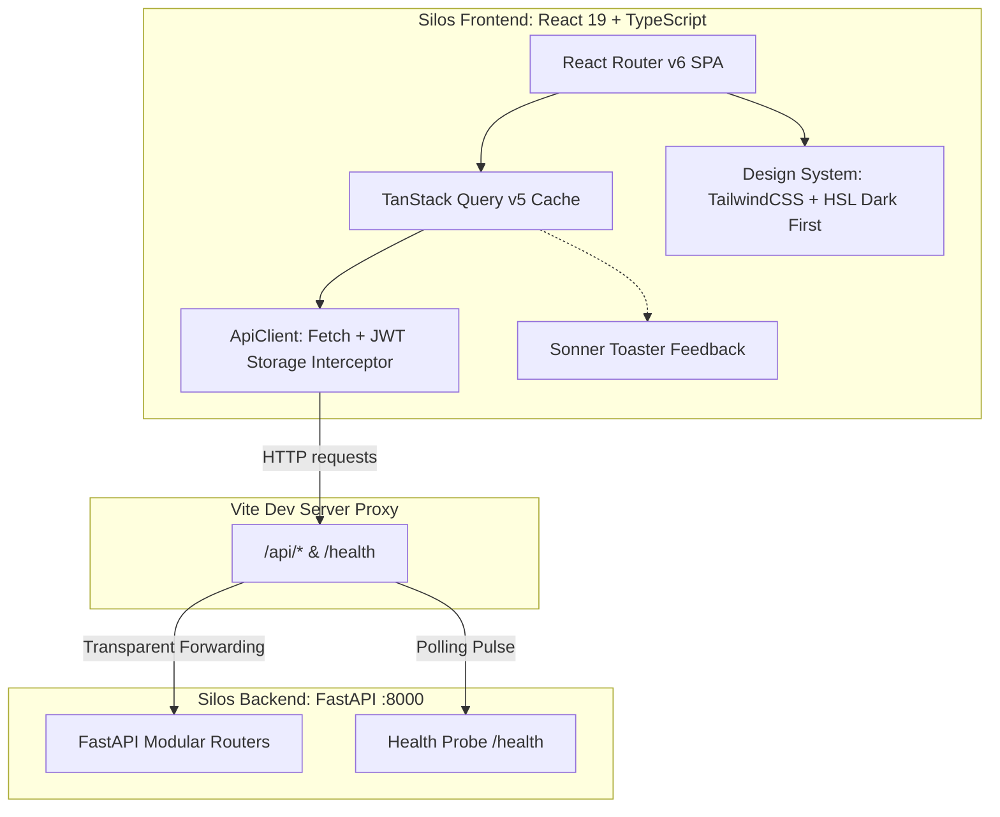

# Architettura Frontend V2.0 (React + Vite + TailwindCSS + Shadcn/UI)

Questo documento costituisce il **riferimento architetturale ufficiale per il silos client-side** (`frontend/`) di FuelPyTracker V2.0.
Traccia in modo persistente e modulare tutte le decisioni tecniche, i contratti dati, il design system e lo stato di avanzamento della **Fase 3 (Bootstrap)** e della **Fase 4 (Ricostruzione Interfaccia UX)**.

---

## 🏛️ 1. Visione Architetturale del Client

Il frontend è un'applicazione web autonoma di tipo **Single Page Application (SPA)** progettata per offrire un'esperienza d'uso moderna, fluida e reattiva, azzerando i tempi di caricamento e superando i limiti del vecchio monolite Streamlit.



### Struttura delle Directory (`frontend/`)
```text
frontend/
├── index.html                # Entry HTML con meta-tag, SEO e Google Fonts (Outfit, Inter)
├── package.json              # Script npm e dipendenze (React 19, Recharts, Zod, Radix, Lucide)
├── tsconfig.app.json         # Alias @/* -> ./src/* con compatibilità TypeScript 6.0
├── vite.config.ts            # Bundler Vite con reverse proxy per /api e /health -> :8000
├── tailwind.config.js        # Design tokens HSL, tailwindcss-animate e breakpoint responsive
├── postcss.config.js         # Pipeline PostCSS + Autoprefixer
└── src/
    ├── main.tsx              # Entry point React
    ├── App.tsx               # Root component con QueryClientProvider, Router e Toaster
    ├── index.css             # Tailwind base/utilities e variabili CSS HSL (Dark Mode First)
    ├── lib/
    │   └── utils.ts          # Helper cn() per merging classi condizionali (clsx + twMerge)
    ├── types/                # Contratti DTO TypeScript sincronizzati 1:1 con Pydantic
    │   ├── auth.ts
    │   ├── dashboard.ts
    │   ├── fuel.ts
    │   ├── maintenance.ts
    │   ├── reminders.ts
    │   ├── settings.ts
    │   ├── reports.ts
    │   ├── system.ts
    │   └── index.ts          # Central re-export
    ├── services/api/         # Livello di trasporto HTTP centralizzato
    │   ├── client.ts         # Wrapper fetch con JWT Bearer e classe personalizzata ApiError
    │   ├── systemApi.ts      # Health check probe
    │   ├── dashboardApi.ts   # KPI summary, serie temporali e trip calculator
    │   └── fuelApi.ts        # Operazioni CRUD e validazione pre-flight chilometrica
    ├── hooks/                # Hook personalizzati TanStack Query
    │   ├── useSystemHealth.ts# Polling live dello stato del server (15s)
    │   └── useDashboardSummary.ts # Cache reattiva dati cruscotto
    ├── components/
    │   ├── ui/               # Primitive Shadcn/UI (Button, Card, Badge, Input, Skeleton, Dialog, Sheet, Tabs, Table, Toaster)
    │   └── layout/           # AppLayout, Sidebar (collassabile/responsive) e Navbar
    └── pages/                # Viste di dominio SPA
        ├── DashboardPage.tsx
        ├── FuelPage.tsx
        ├── MaintenancePage.tsx
        ├── RemindersPage.tsx
        ├── ReportsPage.tsx
        ├── SettingsPage.tsx
        ├── LoginPage.tsx
        └── NotFoundPage.tsx
```

---

## 🚀 2. Fase 3: Bootstrap Frontend (Fondamenta Client)

Completata con successo, la Fase 3 ha realizzato:

1. **Design System Dark Mode First:**
   - Variabili CSS semantiche HSL (`--background: 222 47% 8%`, `--card: 222 47% 11%`, smeraldo `--primary: 158 75% 48%`, ambra per alert e rosa per scadenze).
   - Tipografia premium con Google Fonts (*Outfit* per titoli e brand, *Inter* per testi e tabelle).
2. **Componenti UI Atomici Base:**
   - `Button`: con varianti semantiche (`default`, `emerald`, `secondary`, `outline`, `ghost`, `destructive`), taglie e supporto `asChild`.
   - `Card`: primitives componibili (`CardHeader`, `CardTitle`, `CardDescription`, `CardContent`, `CardFooter`).
   - `Badge`: pillole di stato (`success`, `warning`, `destructive`, `info`, `outline`).
   - `Input`: campi accessibili con outline ring e sfondi dark.
   - `Skeleton`: animazioni a pulsazione (`animate-pulse`) per prevenire layout shifting durante il caricamento asincrono.
3. **Shell di Navigazione SPA (`AppLayout`):**
   - `Sidebar`: desktop collassabile con toggle button, drawer responsive mobile, icone Lucide, badge di conteggio e scheda veicolo attivo (*BMW Serie 1*).
   - `Navbar`: breadcrumb dinamico sincronizzato a `useLocation()`, quick action (*Nuovo Rifornimento*) e indicatore in tempo reale dello stato del backend (*FastAPI Online* con pulse verde).
   - 8 viste scheletriche collegate tramite `react-router-dom`.
4. **Trasporto HTTP & Contratti Dati:**
   - Contratti DTO TypeScript in `src/types/` sincronizzati 1:1 con i modelli Pydantic.
   - Client HTTP unificato con iniezione JWT Bearer e gestione reverse proxy Vite (`/api` e `/health` -> `127.0.0.1:8000`).
   - TanStack Query v5 globale con polling periodico `/health` (15s) e cache a 30s.

---

## 🎨 3. Fase 4: Ricostruzione Interfaccia UX & Componenti

La **Fase 4** trasforma lo scheletro in un'applicazione interattiva completa, fruibile con massima ergonomia sia da desktop sia da smartphone.

### 🔹 Sotto-Fase 4.1: UI Kit Esteso, Form & Librerie Specializzate ✅
- **Pacchetti Integrati:**
  - `recharts`: libreria per grafici interattivi e serie temporali.
  - `react-hook-form` + `@hookform/resolvers` + `zod`: gestione e validazione immediata dei form.
  - `sonner`: sistema di notifiche toast con styling dark ad alto contrasto.
  - `@radix-ui/react-dialog` & `@radix-ui/react-tabs`: primitive accessibili per popup, cassetti e schede.
  - `date-fns`: formattazione temporale localizzata in italiano.
  - `tailwindcss-animate`: animazioni fluide di ingresso e uscita per finestre e cassetti.
- **Componenti UI Creati:**
  - `src/components/ui/dialog.tsx`: finestra modale con sfondo oscurato sfocato, focus trapping e chiusura con tasto ESC.
  - `src/components/ui/sheet.tsx`: cassetto scorrevole laterale (*Side Inspector*) e cassetto dal basso (*Bottom Sheet* per smartphone).
  - `src/components/ui/tabs.tsx`: navigatore a schede per alternare viste e grafici.
  - `src/components/ui/table.tsx`: set di componenti per tabelle dati ad alta densità.
  - `src/components/ui/sonner.tsx`: wrapper Toaster integrato globalmente in `src/App.tsx`.
- **Showcase Interattivo:**
  - Integrato in `src/pages/SettingsPage.tsx` un pannello di collaudo per testare in tempo reale notifiche toast, modali Dialog, cassetti Sheet e Tabs.
- **Esito Collaudo:** `npm run lint` con 0 errori e 0 warning su 42 file; `npm run build` completato in 1.26s.

---

## 🗺️ 4. Roadmap di Avanzamento Fase 4

| Step | Titolo | Obiettivo Principale | Stato |
| :--- | :--- | :--- | :--- |
| **Step 4.1** | **UI Kit Esteso & Librerie** | Recharts, Zod, Sonner, Dialog, Sheet, Tabs, Table | ✅ **Completato** |
| **Step 4.2** | **Shell Adattiva & Mobile** | Bottom Navigation Bar per smartphone, pulsante FAB centrale `+` | 🔄 **In Corso** |
| **Step 4.3** | **Dashboard Reattiva** | KPI dinamici, grafici Recharts (prezzi, km/L, spesa), Car Health Score | ⏳ Pianificato |
| **Step 4.4** | **Dominio Rifornimenti & OCR** | Doppia vista tabella/schede, modale inserimento con validazione live, OCR | ⏳ Pianificato |
| **Step 4.5** | **Manutenzioni & Promemoria** | Timeline cronologica, semaforo scadenze, azione atomica *Mark as Done* | ⏳ Pianificato |
| **Step 4.6** | **Report & Staging Import** | Download center Excel/PDF, importatore drag&drop con anteprima a semafori | ⏳ Pianificato |
| **Step 4.7** | **Impostazioni & Categorie** | Form soglie carburante, gestore categorie con tag interattivi | ⏳ Pianificato |
| **Step 4.8** | **Collaudo Globale E2E UX** | Certificazione browser end-to-end e documentazione conclusiva | ⏳ Pianificato |
